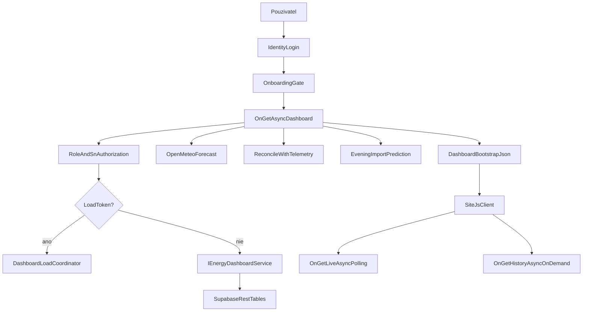
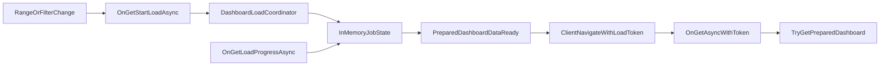

# NestStats2 — Technická dokumentácia aplikácie

> Dokument je navrhnutý ako akademický podklad pre diplomovú prácu: prepája produktový kontext, architektúru, tok dát, implementačné rozhodnutia, limity a odporúčania pre ďalší vývoj. Všetky tvrdenia sú trasovateľné do konkrétnych zdrojových súborov.

---

## Obsah

- [1. Cieľ a rozsah dokumentu](#1-cieľ-a-rozsah-dokumentu)
- [2. Problémová doména a motivácia](#2-problémová-doména-a-motivácia)
- [3. Koncepcia platformy NestStats](#3-koncepcia-platformy-neststats)
- [4. Celková architektúra riešenia](#4-celková-architektúra-riešenia)
  - [4.1 Architektonický štýl](#41-architektonický-štýl)
  - [4.2 Middleware pipeline](#42-middleware-pipeline)
  - [4.3 Registrácia služieb (DI kontajner)](#43-registrácia-služieb-di-kontajner)
  - [4.4 Verejné a chránené stránky](#44-verejné-a-chránené-stránky)
  - [4.5 Lokalizácia a jazyková vrstva](#45-lokalizácia-a-jazyková-vrstva)
  - [4.6 Startup inicializačná brana](#46-startup-inicializačná-brana)
  - [4.7 Modulová mapa aplikácie](#47-modulová-mapa-aplikácie)
- [5. Dashboard ako centrálna časť systému](#5-dashboard-ako-centrálna-časť-systému)
  - [5.1 Server-side orchestrácia — IndexModel](#51-server-side-orchestrácia--indexmodel)
  - [5.2 Bootstrap kontrakt backend → frontend](#52-bootstrap-kontrakt-backend--frontend)
  - [5.3 Klientska vrstva a pravidelný live refresh](#53-klientska-vrstva-a-pravidelný-live-refresh)
  - [5.4 Asynchrónny preload mechanizmus](#54-asynchrónny-preload-mechanizmus)
  - [5.5 Preferencie dashboardu (cookie)](#55-preferencie-dashboardu-cookie)
  - [5.6 Kalibrácia počasovej predikcie s telemetriou](#56-kalibrácia-počasovej-predikcie-s-telemetriou)
  - [5.7 Večerný importný model (EveningImportPrediction)](#57-večerný-importný-model-eveningimportprediction)
  - [5.8 Export dát (CSV)](#58-export-dát-csv)
- [6. Dátový tok end-to-end](#6-dátový-tok-end-to-end)
- [7. Dátové zdroje a integrácie](#7-dátové-zdroje-a-integrácie)
  - [7.1 Supabase — telemetria a agregácie](#71-supabase--telemetria-a-agregácie)
  - [7.2 Open-Meteo — počasová predikcia](#72-open-meteo--počasová-predikcia)
  - [7.3 OKTE — spotový trh](#73-okte--spotový-trh)
  - [7.4 SMTP — e-mailový sender](#74-smtp--e-mailový-sender)
  - [7.5 Fallback a degradačné scenáre](#75-fallback-a-degradačné-scenáre)
- [8. Doménový model a entity](#8-doménový-model-a-entity)
  - [8.1 ApplicationUser](#81-applicationuser)
  - [8.2 UserEnergySystemAssignment](#82-userenergysystemassignment)
  - [8.3 ApplicationDbContext](#83-applicationdbcontext)
  - [8.4 DashboardData](#84-dashboarddata)
  - [8.5 DashboardBootstrap](#85-dashboardbootstrap)
  - [8.6 LiveSnapshot a TimeSeriesPoint](#86-livesnapshot-a-timeseriespoint)
  - [8.7 Ostatné DTO modely](#87-ostatné-dto-modely)
- [9. Bezpečnosť a autorizácia](#9-bezpečnosť-a-autorizácia)
  - [9.1 Role model](#91-role-model)
  - [9.2 Autorizácia na úrovni systému (SN access control)](#92-autorizácia-na-úrovni-systému-sn-access-control)
  - [9.3 Externá autentifikácia](#93-externá-autentifikácia)
  - [9.4 Ochrana prihlasovacích údajov k systémom](#94-ochrana-prihlasovacích-údajov-k-systémom)
  - [9.5 Citlivé konfigurácie](#95-citlivé-konfigurácie)
- [10. Prevádzka a výkon](#10-prevádzka-a-výkon)
  - [10.1 Cache stratégie](#101-cache-stratégie)
  - [10.2 Response compression](#102-response-compression)
  - [10.3 Polling a live refresh](#103-polling-a-live-refresh)
  - [10.4 Statické súbory](#104-statické-súbory)
- [11. Obmedzenia riešenia](#11-obmedzenia-riešenia)
- [12. Odporúčania pre ďalšiu iteráciu](#12-odporúčania-pre-ďalšiu-iteráciu)
- [13. Reprodukovateľnosť a validita tvrdení](#13-reprodukovateľnosť-a-validita-tvrdení)
- [14. Nástroje a návrhové kalkulačky](#14-nástroje-a-návrhové-kalkulačky)
- [15. Grafy, metriky a vysvetlivky vizualizácií](#15-grafy-metriky-a-vysvetlivky-vizualizácií)
- [16. UX stavy, interakcie a používateľské scenáre](#16-ux-stavy-interakcie-a-používateľské-scenáre)
- [17. Dátová kvalita, validácia a prevádzkové riziká](#17-dátová-kvalita-validácia-a-prevádzkové-riziká)
- [18. Rozšírený testovací a validačný plán](#18-rozšírený-testovací-a-validačný-plán)
- [19. Firmware a edge nody](#19-firmware-a-edge-nody)
- [Záver](#záver)

---

## 1. Cieľ a rozsah dokumentu

Cieľom je poskytnúť rozsiahly a technicky presný popis systému NestStats2 tak, aby dokument mohol byť priamo použitý v kapitole „Návrh a implementácia" diplomovej práce.

Rozsah dokumentu:
- pokrýva aktuálnu implementáciu v repozitári `NestStats2`,
- mapuje hlavné rozhodnutia na konkrétne súbory a triedy,
- rozširuje popis dashboardu do implementačnej hĺbky (endpointy, dátový kontrakt, stavový tok, refresh stratégie, večerný model rizika),
- explicitne oddeľuje aktuálne implementované časti od dlhodobej vízie platformy NestStats.

**Čo tento dokument nie je:**
- marketingový popis produktu,
- roadmap budúcich funkcií,
- substitúcia za zdrojový kód.

---

## 2. Problémová doména a motivácia

Rezidenčné fotovoltické systémy produkujú maximum energie v čase, keď je domáca spotreba často nízka. Vzniká tak opakovaná situácia:
- vysoká exportovaná energia za nižšiu výkupnú cenu,
- následný import energie vo večerných hodinách za vyššiu retail cenu,
- nižšia ekonomická efektivita investície do FV.

NestStats rieši tento nesúlad dvoma vrstvami:
1. **Operatívna vrstva** — zber telemetrie, stav systému, dashboard v reálnom čase.
2. **Analytická vrstva** — historické trendy, predikčné ukazovatele, doplnkové externé dáta (počasie, spotový trh).

V kontexte NestStats2 je nosným artefaktom webový dashboard, ktorý spája autentifikáciu, autorizáciu podľa priradených systémov, zber a agregáciu dát a ich vizuálnu interpretáciu.

---

## 3. Koncepcia platformy NestStats

Pôvodná platforma NestStats (historicky širší ekosystém) zahŕňa:
- hardware uzly (ESP32) pre meranie a riadenie,
- cloudovú vrstvu telemetrie (Supabase),
- webovú aplikáciu.

Aktuálny repozitár `NestStats2` sa sústreďuje na **webovú aplikáciu**:
- identity + onboarding + assignment flow,
- klientský dashboard s live/history vrstvou,
- napojenie na externé dáta (Supabase, Open-Meteo, OKTE),
- verejné informačné a pracovné stránky (o nás, nástroje, návrh FV, návrh TČ, 15-minútová intervalová analýza).

Tento dokument „stavia na pôvodnom dizajne", ale technické jadro mapuje na to, čo je reálne implementované v aktuálnom kóde.

---

## 4. Celková architektúra riešenia

### 4.1 Architektonický štýl

Použitý je model **ASP.NET Core Razor Pages** (monolit):
- server-rendered UI + PageModel logika,
- interný JSON interface cez page handlery (nie samostatné API controllery),
- klientský JavaScript pre interakcie, polling a priebežný refresh.

Výhody tohto prístupu:
- jednoduchá kohézia medzi page routou a backend logikou,
- rýchly prvotný render cez SSR bootstrap,
- nízka zložitosť infraštruktúry (jeden process, jedna databáza).

Nevýhody:
- rastúca koncentrácia zodpovednosti v hlavnom dashboard PageModeli,
- ťažšia modularizácia klientských skriptov pri raste funkcionality,
- chýbajúca formálna API boundary pre budúcich mobilných klientov.

**Zdroj:** `Program.cs` — celková konfigurácia aplikácie.

### 4.2 Middleware pipeline

Middleware je registrovaný v `Program.cs` v tomto poradí:

```
1. ExceptionHandler (/Error)        — iba v produkcii
2. HSTS                             — iba v produkcii
3. HTTPS Redirection
4. Response Compression             — Gzip/Brotli pre HTML, JSON, SVG
5. Static Files                     — wwwroot, s CacheControl hlavičkami
6. /startup-status endpoint         — JSON snapshot inicializačného stavu
7. Startup gate middleware          — blokuje požiadavky, kým nie je Ready
8. Request Localization             — SK/EN podľa cookie alebo URL cesty
9. Routing
10. Authentication
11. Authorization
12. /language/set endpoint          — nastavenie jazykovej cookie
13. MapRazorPages()
```

Toto poradie je funkčne kritické: napríklad statické súbory a `/startup-status` sú odbavené pred startup gate, takže loading stránka sa môže zobrazovať aj keď aplikácia ešte inicializuje.

**Zdroj:** `Program.cs`, riadky 153–281.

### 4.3 Registrácia služieb (DI kontajner)

Prehľad kľúčových DI registrácií z `Program.cs`:

| Životnosť | Typ | Implementácia |
|---|---|---|
| Singleton | `AppLanguageService` | in-memory jazyková pomôcka |
| Singleton | `StartupInitializationState` | stav inicializácie aplikácie |
| Singleton | `IDashboardLoadCoordinator` | `DashboardLoadCoordinator` — in-memory job store |
| Hosted Service | — | `StartupInitializationHostedService` |
| Typed HttpClient | `IEnergyDashboardService` | `SupabaseEnergyDashboardService` |
| Typed HttpClient | `IWeatherForecastService` | `OpenMeteoWeatherForecastService` |
| Typed HttpClient | `ISpotMarketPriceService` | `OkteSpotMarketPriceService` |
| Scoped | `ApplicationDbContext` | SQLite cez EF Core |
| Scoped | `IdentitySchemaUpdater` | migrácia schémy |
| Scoped | `IdentitySeeder` | seed rôl a admin účtu |
| Scoped | `ISystemCredentialProtector` | `SystemCredentialProtector` |
| Scoped | `INestStatsPvPdfExportService` | `NestStatsPvPdfExportService` |
| Scoped | `IUserPreferencesService` | `CookieUserPreferencesService` |
| Transient | `IEmailSender` / `SmtpIdentityEmailSender` | SMTP odosielač |

**Dôležitá poznámka:** `IDashboardLoadCoordinator` je registrovaný ako **singleton** — drží in-memory job state pre celú životnosť aplikácie. To je zámerné pre single-instance deployment, ale vyžaduje pozornosť pri horizontálnom škálovaní.

**Zdroj:** `Program.cs`, riadky 16–84.

### 4.4 Verejné a chránené stránky

Defaultná politika `AuthorizeFolder("/")` chráni všetky stránky. Explicitné výnimky:

**Verejné stránky (AllowAnonymous):**
- `Areas/Identity/Account/*` — prihlásenie, registrácia, reset hesla
- `/Privacy`
- `/SpoznajNas` → alias `/about-us` (EN kultúra)
- `/NavrhFotovoltaiky/Index` → alias `/pv-design` (EN kultúra)
- `/NavrhTC/Index` → alias `/heat-pump-design` (EN kultúra)

**Chránené stránky (vyžadujú autentifikáciu):**
- `/` (Index/Dashboard)
- `/Onboarding`
- `/Systems/Connect`
- `/Settings`
- `/Admin/*`

**Zdroj:** `Program.cs`, riadky 16–29.

### 4.5 Lokalizácia a jazyková vrstva

Aplikácia podporuje dve kultúry: **SK** (predvolená) a **EN**. Kultúra sa určuje custom providerom v tomto poradí:
1. **URL cesta** — anglické aliasy (napr. `/about-us`, `/tools`) automaticky prepnú na EN kultúru.
2. **Cookie** (`CookieRequestCultureProvider`) — používateľská preferencia uložená v cookie.
3. Fallback na SK.

Prepínanie jazyka: `GET /language/set?culture=sk&returnUrl=/` — nastaví cookie na 1 rok.

**Zdroj:** `Program.cs`, riadky 85–127, 258–279.

### 4.6 Startup inicializačná brana

`StartupInitializationHostedService` vykonáva po štarte aplikácie inicializačné úkony (migrácia DB, seeding). Stav je sledovaný cez `StartupInitializationState`.

Middleware v pipeline blokuje všetky HTML požiadavky, kým nie je stav `IsReady == true`. Výnimky:
- statické súbory (CSS, JS, obrázky),
- `/startup-status` endpoint (monitoring),
- `/language/set`.

Ak `HasFailed == true`, odpoveď má HTTP 503. Počas inicializácie má odpoveď HTTP 202 a zobrazí sa loading HTML stránka (renderovaná priamo z `StartupInitializationState.RenderHtml`).

**Zdroj:** `Program.cs`, riadky 174–253; `Services/StartupInitializationHostedService.cs`.

### 4.7 Modulová mapa aplikácie

Kľúčové moduly:
- `Pages/Index.cshtml(.cs)` — dashboard a jeho interný endpoint surface (6 handlerov)
- `Services/SupabaseEnergyDashboardService.cs` — telemetria, history a live snapshot
- `Services/DashboardLoadCoordinator.cs` — async load orchestrácia
- `Services/OpenMeteoWeatherForecastService.cs` — weather enrichment + cache
- `Services/OkteSpotMarketPriceService.cs` — spot dáta parsing + cache
- `Data/ApplicationDbContext.cs` + `Models/ApplicationUser.cs` — identity a user preferencie
- `Pages/Onboarding/Index.cshtml(.cs)` — onboarding gate
- `Pages/Systems/Connect.cshtml(.cs)` — SN + password assignment flow
- `Pages/Settings/Index.cshtml(.cs)` — profilové a preferencné nastavenia
- `Pages/Admin/Index.cshtml(.cs)`, `Pages/Admin/Assignments.cshtml(.cs)` — administrácia
- `Pages/Nastroje/Index.cshtml` — verejný rozcestník návrhových a analytických nástrojov
- `Pages/NavrhFotovoltaiky/Index.cshtml(.cs)` — FV kalkulačka, serverový výpočet a PDF export
- `Pages/NavrhTC/Index.cshtml` — klientská kalkulačka úspory tepelného čerpadla
- `Pages/IntervalovaAnalyza/Index.cshtml(.cs)` — import 15-minútových dát, simulácia FV/batérie a optimalizácia
- `Services/NestStatsPvPdfExportService.cs` — PDF report pre FV návrh
- `Services/AnalysisPdfExportService2.cs` — PDF report pre 15-minútovú intervalovú analýzu
- `Services/NepCalculatorPreferences.cs` — preferencie kalkulačiek a opakované použitie vstupov
- `Firmwares/*.ino` — Arduino/ESP32/ESP8266 edge nody pre zber dát, lokálnu reguláciu a upload do Supabase
- `Firmwares/WAVESHAREV1` — ESP-IDF projekt pre lokálny displej/monitor s priamym čítaním Supabase dát

---

## 5. Dashboard ako centrálna časť systému

### 5.1 Server-side orchestrácia — IndexModel

Hlavný orchestrátor je `IndexModel` v `Pages/Index.cshtml.cs`. Exponuje **šesť page handlerov**:

| Handler | Popis |
|---|---|
| `OnGetAsync` | Hlavná stránka — SSR bootstrap |
| `OnGetLiveAsync(snNumber)` | Aktuálny live snapshot (JSON) |
| `OnGetHistoryAsync(snNumber, window, day)` | Historické denné body (JSON) |
| `OnGetStartLoadAsync(snNumber, day, hoursBack, quietRefresh)` | Spustenie async preload jobu (JSON) |
| `OnGetLoadProgressAsync(jobId)` | Priebeh preload jobu (JSON) |
| `OnGetExportAsync(snNumber, day, hoursBack, dataset)` | CSV export dát |

**Zodpovednosti `OnGetAsync`:**
1. Overenie autentifikácie a role (`IsAdmin`).
2. Načítanie priradených systémov z DB (`UserEnergySystems`).
3. Detekcia `OnboardingCompletedUtc` — ak klient nemá preferovaný systém, presmeruje na `/Onboarding/Index`.
4. Čítanie preferencií z cookie (`neststats.dashboard.{userId}`).
5. Riešenie `LoadToken` — ak je k dispozícii, načíta predpripravené dáta z `DashboardLoadCoordinator`.
6. Inak: `GetDashboardAsync` z `IEnergyDashboardService`.
7. Enrichovanie počasovej predikcie + reconciliation s telemetriou.
8. Výpočet večerného importného modelu.
9. Zostavenie `DashboardBootstrap` a jeho serializácia do `DashboardJson`.
10. Aktualizácia preferencií v cookie.
11. Prípadný zápis `LastSeenUtc`, `PreferredSystemSn` do DB (max každých 5 min).

**Povolené hodnoty `HoursBack`:** `6, 12, 24, 48, 72, 168` (ostatné sa normalizujú na 24).

**Povolené hodnoty history window:** `7, 14, 30` dní, alebo `"all"` (ostatné → 7).

**`CanShowDashboard`:** `IsAuthenticated && (IsAdmin || AssignedSystemCount > 0)` — podmienka pre zobrazenie dashboardu.

**Zdroj:** `Pages/Index.cshtml.cs`, trieda `IndexModel`.

### 5.2 Bootstrap kontrakt backend → frontend

Po inicializácii `OnGetAsync` zostaví inštanciu `DashboardBootstrap` a serializuje ju do `DashboardJson`, ktorý je vložený do DOM a klient ho načíta bez ďalšieho inicializačného roundtripu.

**Štruktúra `DashboardBootstrap`** (trieda v `Models/DashboardModels.cs`):

```
LiveEndpoint             — URL pre live polling
HistoryEndpoint          — URL pre history fetch
LoadStartEndpoint        — URL pre StartLoad handler
LoadProgressEndpoint     — URL pre LoadProgress handler
RefreshSeconds           — 15 sekúnd (konštanta)
WattMaxKw                — kapacita WattRouteru
InstalledPvKw            — inštalovaný výkon FV
BatteryCapacityKwh       — kapacita batérie
RelayChannelCount        — počet SSR kanálov
Charts                   — DashboardChartPayload (Timeline, History, Totals)
InitialLive              — LiveSnapshot pre okamžitý render
EnergyBreakdowns         — EnergyBreakdownBar[]
SmartForecast            — SmartForecastSummary
Anomalies                — SystemAnomaly[]
OperatorRecommendations  — OperatorRecommendation[]
Weather                  — WeatherForecastSummary
EveningImport            — EveningImportPrediction
EnvironmentalBenefits    — EnvironmentalBenefitSummary
SpotMarket               — SpotMarketSummary
DailyStories             — DailyEnergyStory[]
```

Tento bootstrap eliminuje potrebu ďalšieho API volania pre prvý render — klient má všetky dáta ihneď k dispozícii.

**Zdroj:** `Models/DashboardModels.cs` — trieda `DashboardBootstrap`; `Pages/Index.cshtml.cs`, riadky 237–263.

### 5.3 Klientska vrstva a pravidelný live refresh

`wwwroot/js/site.js` realizuje celú klientsku logiku:
- parse bootstrap payloadu z DOM,
- render metrík a grafov (charts, živé hodnoty, stavové pills),
- periodické `fetch` volania live endpointu (každých 15 sekúnd),
- history načítanie podľa vybraného okna,
- správu lokálnych preferencií (cookies/session storage),
- UI stav side-nav a sekcií dashboardu,
- async preload flow (StartLoad → polling LoadProgress → navigácia s LoadToken).

Klientska vrstva je navrhnutá bez SPA frameworku. To drží stack jednoduchý, ale z pohľadu udržateľnosti je vhodná ďalšia modularizácia JS časti.

**Zdroj:** `wwwroot/js/site.js`.

### 5.4 Asynchrónny preload mechanizmus

Pre rozsiahlejšie načítanie (zmena rozsahu, filtra) sa nepoužíva priame blokovanie hlavnej navigácie.

**Tok asynchrónneho preload:**
1. Klient zavolá `OnGetStartLoadAsync` — vracia `{ jobId, navigateUrl }`.
2. Backend zaregistruje job v `DashboardLoadCoordinator.StartJob(...)`.
3. Job beží asynchrónne v pozadí (`Task.Run`) — načíta dashboard dáta + počasie.
4. Klient polluje `OnGetLoadProgressAsync(jobId)` — vracia `DashboardLoadSnapshot`.
5. Po `Completed == true` klient naviguje na `navigateUrl` (obsahuje `LoadToken`).
6. Ďalší `OnGetAsync` s `LoadToken` načíta predpripravené dáta z coordinatoru (`TryGetPreparedDashboard`).

**Fázy jobu** (stage hodnoty):
- `"Priprava"` (2 %) → `"System"` (5 %) → progress zo service → `"Pocasie"` (90 %) → `"Render"` (97 %) → `"Hotovo"` (100 %)

**TTL jobov:** 15 minút (`JobLifetime`). Expirované joby sa automaticky čistia pri ďalšom volaní.

**Implementačná poznámka:** `DashboardLoadCoordinator` vytvára vlastný DI scope (`IServiceScopeFactory.CreateAsyncScope()`), pretože sám je singleton a potrebuje prístup k scoped service `IEnergyDashboardService`.

**Zdroj:** `Services/DashboardLoadCoordinator.cs`.





### 5.5 Preferencie dashboardu (cookie)

Každý používateľ má vlastnú preference cookie s názvom `neststats.dashboard.{userId}` (userId filtrovaný na alfanumerické znaky). Cookie je URL-escaped JSON so štruktúrou `DashboardPreferenceState`:

| Pole | Popis |
|---|---|
| `Version` | Verzia schémy (aktuálne 1) |
| `SystemSn` | Naposledy vybraný SN systém |
| `Day` | Naposledy vybraný deň |
| `HoursBack` | Naposledy vybraný časový rozsah |
| `TariffProviderKey` / `TariffPlanKey` | Preferencie tarify |
| `TrendSeries` / `TrendWindowMin/Max` | Nastavenia trend grafu |
| `HistoryWindow` / `HistoryPage` | Nastavenia history sekcie |
| `WeatherDay` | Vybraný deň v počasovom widgete |
| `ActiveSection` | Aktívna sekcia UI |
| `UpdatedUtc` | Čas poslednej aktualizácie (ISO 8601) |

**Životnosť cookie:** 180 dní. Cookie je `HttpOnly: false` (klient ju musí čítať), `SameSite: Lax`, `Secure` ak je HTTPS.

**Zdroj:** `Pages/Index.cshtml.cs`, riadky 647–707, trieda `DashboardPreferenceState` (riadky 1078–1094).

### 5.6 Kalibrácia počasovej predikcie s telemetriou

`ReconcileWeatherForecastWithTelemetry` kalibruje hodinovú počasovú predikciu skutočnými telemetrickými hodnotami zo dneška:

1. Nájde aktuálne FV body z `Charts.Timeline` pre dnešný deň (`PvKw > 0.05`).
2. Porovná maximum skutočnej FV výroby dnes s maximom predpovede na rovnakom časovom úseku.
3. Vypočíta `calibrationRatio` (obmedzené na rozsah 0,9 — inštalovaný výkon × 1,03).
4. Ak je odchýlka > 8 %, prepočíta `EstimatedPvKw` pre všetky dnešné hodiny.

Výsledok: predpoveď je dynamicky kalibrovaná na podmienky konkrétneho dňa. Ak skutočná FV výroba naznačuje horšie podmienky (tieň, oblačnosť), predpoveď sa automaticky zníži.

**Zdroj:** `Pages/Index.cshtml.cs`, metóda `ReconcileWeatherForecastWithTelemetry` (riadky 873–995).

### 5.7 Večerný importný model (EveningImportPrediction)

`BuildEveningImportPrediction` vypočíta riziko večerného importu energie zo siete pre časové okno `17:00–23:30` (dnes alebo zajtra ak je po 23:30).

**Vstupy modelu:**
- aktuálna batéria: `LatestBatterySoC`, `BatteryCapacityKwh`,
- hodinová FV predpoveď z Open-Meteo (kalibrovaná telemetriou),
- historická spotreba (14 dní) z `History`,
- aktuálne hodnoty `LatestGridKw`, `LatestWattKw`.

**Výpočet rizika:**
```
importPressurePct    = expectedImportKwh / eveningConsumptionKwh * 100
lowSocPenalty        = 22 ak SoC < 25 %, 12 ak < 40 %, 5 ak < 55 %
weatherPenalty       = 8 ak celková FV (pred + počas večera) < 0,8 kWh
currentImportPenalty = 6 ak GridKw < -0,2 kW
dataPenalty          = 8 ak nie je dostupná predpoveď počasia

riskPct = CLAMP(importPressurePct * 0,72 + penálie, 0, 100)
```

**Výsledkové úrovne:**
- `"good"` (< 24 %) — večer je pod kontrolou,
- `"accent"` (24–45 %) — malá rezerva,
- `"warning"` (46–71 %) — import je možný,
- `"danger"` (≥ 72 %) — vysoké riziko importu.

**Zdroj:** `Pages/Index.cshtml.cs`, metódy `BuildEveningImportPrediction`, `EstimateConsumptionKwh`, `EstimateWeatherPvKwh` (riadky 709–1076).

### 5.8 Export dát (CSV)

Handler `OnGetExportAsync` exportuje dáta vo formáte CSV. Parameter `dataset` určuje typ:

**`dataset=history`** — denné agregáty (13 stĺpcov):
```
Date, SystemName, SnNumber,
PvKwh, ConsumptionKwh, ImportKwh, ExportKwh,
BatteryChargeKwh, BatteryDischargeKwh,
SelfUseKwh, SelfUsePct, SelfSufficiencyKwh, SelfSufficiencyPct
```

**`dataset=timeline`** — časová rada 5-minútových meraní (23 stĺpcov):
```
LocalTime, SystemName, SnNumber,
PvKw, ConsumptionKw, GridKw, BatteryKw, InverterKw, WattKw,
SoC, PvSaturationPct, WattUtilizationPct, RelayAverageLoadPct, RelaysOn,
Mppt1Kw, Mppt2Kw, GridFetch,
PvVoltageV, PvCurrentA, BatteryVoltageV, BatteryCurrentA,
BatteryTemperatureC, GridFrequencyHz
```

Súbor sa menuje `neststats-{sn}-{dataset}-{datum}.csv`.

**Zdroj:** `Pages/Index.cshtml.cs`, metódy `OnGetExportAsync`, `BuildHistoryCsv`, `BuildTimelineCsv` (riadky 472–613).

---

## 6. Dátový tok end-to-end

```
1. Login
   → ASP.NET Core Identity (Areas/Identity/.../Login.cshtml.cs)
   → Lokálne konto alebo externý provider (Google / Facebook)

2. Onboarding gate
   → IndexModel.OnGetAsync: ak OnboardingCompletedUtc == null a AssignedSystemCount == 0
   → Redirect na Pages/Onboarding/Index

3. Priradenie systému
   → Pages/Systems/Connect: zadanie SN + hesla
   → SystemCredentialProtector šifruje heslo (Data Protection)
   → Uloženie UserEnergySystemAssignment do SQLite
   → PreferredSystemSn sa nastaví na nový systém

4. Nastavenia a profil
   → Pages/Settings/Index: DisplayName, PreferredProviderKey, PreferredTariffKey

5. Dashboard načítanie (OnGetAsync)
   → Načítanie assignedSystems z DB
   → Overenie SN oprávnenia
   → Čítanie/písanie preference cookie
   → LoadToken → Coordinator alebo GetDashboardAsync
   → Weather enrichment + reconciliation
   → EveningImport výpočet
   → Bootstrap serializácia → DashboardJson do DOM

6. Live režim (klient, každých 15 s)
   → OnGetLiveAsync(snNumber) → Supabase (cache 10 s) → JSON

7. History on-demand
   → OnGetHistoryAsync(snNumber, window, day) → Supabase → JSON

8. Async preload (pri zmene rozsahu)
   → OnGetStartLoadAsync → DashboardLoadCoordinator.StartJob
   → Klient polluje OnGetLoadProgressAsync
   → Po dokončení navigácia s LoadToken

9. Export
   → OnGetExportAsync → GetDashboardAsync → CSV súbor
```

---

## 7. Dátové zdroje a integrácie

### 7.1 Supabase — telemetria a agregácie

`SupabaseEnergyDashboardService` komunikuje cez REST API (`/rest/v1/`) s Supabase.

**Číta z týchto tabuliek:**

| Tabuľka | Obsah |
|---|---|
| `SYSTEM` | Metadáta systémov: `sn_number`, `system_name`, `system_address`, `pocet_ssr`, `popis` |
| `WATTROUTER_INFO` | Stav SSR relé kanálov, `powerPercentage`, `gridFetch` |
| `PV_INFORMATION` | MPPT merania: `voltage`, `current`, `power`, kanál |
| `BATTERY_INFORMATION` | Batéria: `voltage`, `current`, `power`, `temperature`, `soc`, `soh`, `charge_cycle` |
| `GRID_INFORMATION` | Sieť: výkon, prúd a napätie pre fázy R/S/T, frekvencia |
| `STATISTICAL_INFORMATION` | Denné súčty: výroba, spotreba, nákup, predaj, batéria |

**Technické detaily:**
- **Pageovanie:** 1 000 riadkov na stránku (`SupabasePageSize`).
- **Časový offset:** Historické záznamy sú v DB uložené s +1 hodina (starší firmvér hardvérového uzla ukladal čas so time skew). Offset je kompenzovaný v aplikácii (`DatabaseTimestampOffset = 1h`), nie v DB — technický dlh.
- **História:** načíta sa maximálne 45 dní (`StatsHistoryDays`), limit 50 000 riadkov (`StatsMaxRows`).
- **Cache systémov:** `ConcurrentDictionary` in-memory, TTL 2 minúty.
- **Cache live snapshot:** TTL 10 sekúnd — ochrana pred burst pollingom.

**Autentifikácia:** HTTP hlavičky `apikey` a `Authorization: Bearer {anonKey}`.

**Zdroj:** `Services/SupabaseEnergyDashboardService.cs`.

### 7.2 Open-Meteo — počasová predikcia

`OpenMeteoWeatherForecastService`:

1. Geokóduje adresu systému cez **Nominatim** (OpenStreetMap) → získa `latitude`, `longitude`.
2. Zavolá **Open-Meteo** forecast API s hodinovými dátami: teplota, oblačnosť, zrážky, vietor, shortwave/direct/diffuse radiácia.
3. Z radiačných dát a inštalovaného výkonu FV odhadne hodinový `EstimatedPvKw`.
4. Výsledok cachuje na hodinovom kľúči (cache kľúč: `{adresa}:{hodina}`).

**Fallback:** Ak geokódovanie alebo API volanie zlyhá, `WeatherForecastSummary.IsAvailable == false` a frontend zobrazí stav bez predpovede.

**Zdroj:** `Services/OpenMeteoWeatherForecastService.cs`.

### 7.3 OKTE — spotový trh

`OkteSpotMarketPriceService`:

1. Stiahne CSV súbory zo stránky OKTE (operátor trhu s elektrinou v SR).
2. Parsuje ceny podľa locale `sk-SK` (desatinná čiarka).
3. Zostaví `SpotMarketSummary` s dnes/zajtra a hodinovými bodmi.
4. Cachuje summary s krátkym TTL.

Výstup obsahuje aktuálny interval, minimum, maximum, priemer a flag záporných cien.

**Zdroj:** `Services/OkteSpotMarketPriceService.cs`.

### 7.4 SMTP — e-mailový sender

`SmtpIdentityEmailSender` implementuje tri interface:
- `IEmailSender` (ASP.NET Core Identity),
- `Microsoft.AspNetCore.Identity.IEmailSender<ApplicationUser>` (generická verzia).

Používa sa pre potvrdenie registrácie a reset hesla. Konfigurácia cez `EmailOptions` (sekcia `Email` v `appsettings.json`).

**Zdroj:** `Services/SmtpIdentityEmailSender.cs`.

### 7.5 Fallback a degradačné scenáre

| Scenár | Správanie aplikácie |
|---|---|
| Supabase nedostupný | `GetDashboardAsync` vráti prázdny `DashboardData`, frontend zobrazí prázdny stav |
| Open-Meteo nedostupný | `Weather.IsAvailable == false`, EveningImport model dostane `dataPenalty +8` |
| OKTE nedostupný | `SpotMarket.IsAvailable == false`, sekcia cien sa nezobrazuje |
| Preload job zlyhá | `Failed == true`, klient presmeruje na normálny refresh |
| Žiadny priradený systém | Redirect na `/Onboarding/Index` |
| Neplatný LoadToken | `TryGetPreparedDashboard` vráti `null`, fallback na štandardné načítanie |

---

## 8. Doménový model a entity

### 8.1 ApplicationUser

Rozšírenie `IdentityUser` o doménové polia (`Models/ApplicationUser.cs`):

| Pole | Typ | Popis |
|---|---|---|
| `DisplayName` | `string` | Zobrazované meno (max 160 znakov) |
| `PreferredProviderKey` | `string` | Kľúč preferovaného dodávateľa energie (max 64) |
| `PreferredTariffKey` | `string` | Kľúč preferovanej tarify (max 64) |
| `PreferredSystemSn` | `string` | SN posledného zobrazeného systému (max 128) |
| `CreatedUtc` | `DateTimeOffset` | Čas vytvorenia konta |
| `LastSeenUtc` | `DateTimeOffset?` | Posledná aktivita (aktualizuje sa každých 5 min) |
| `OnboardingCompletedUtc` | `DateTimeOffset?` | Čas dokončenia onboardingu |
| `EnergySystems` | `ICollection<UserEnergySystemAssignment>` | Navigačná vlastnosť |

### 8.2 UserEnergySystemAssignment

Priradenie systému k používateľovi (`Models/UserEnergySystemAssignment.cs`):

- Primárny kľúč: `Id`
- Unikátny index: `(UserId, SnNumber)` — jeden používateľ môže mať každý SN priradený iba raz
- `EncryptedPassword` — povinné, šifrované cez Data Protection
- `IsPrimary` — primárny systém má prednosť pri zoradení
- Kaskádové mazanie: pri odstránení používateľa sa mažú aj jeho priradenia

### 8.3 ApplicationDbContext

`ApplicationDbContext : IdentityDbContext<ApplicationUser, IdentityRole, string>` (`Data/ApplicationDbContext.cs`):

- Štandardné Identity tabuľky (Users, Roles, Claims, Tokens, UserLogins, UserRoles)
- `DbSet<UserEnergySystemAssignment> UserEnergySystems`
- Backingová databáza: **SQLite** (súbor `App_Data/neststats-auth.db`)

### 8.4 DashboardData

`DashboardData` je hlavný agregát načítaný zo Supabase a predaný do PageModel. Obsahuje:

**Metadáta systému:**
- `Systems`, `SelectedSnNumber`, `SystemName`, `SystemAddress`, `SystemProfile`
- `InstalledPvKw`, `BatteryCapacityKwh`, `WattMaxKw`, `RelayChannelCount`

**Aktuálne hodnoty (`Latest*`):**
- `LatestPvKw`, `LatestConsumptionKw`, `LatestGridKw`, `LatestBatteryKw`, `LatestInverterKw`, `LatestWattKw`
- `LatestBatterySoC`, `LatestBatteryTempC`
- napätia fáz, prúdy, frekvencia

**Denné KPI (`Today*`):**
- výroba, spotreba, import, export
- nabíjanie/vybíjanie batérie
- self-use, sebestačnosť, self-consumption

**Agregované ukazovatele:**
- `PeakPvKw`, `BaseLoadKw`, `BatteryAutonomyHours`
- `EnergyScore`, `DataFreshnessMinutes`
- `FullLoadHoursToday`, `SpecificYieldToday`

**Celoživotné hodnoty (`Lifetime*`):**
- kumulatívna výroba, spotreba, import, export

**Projekcie:**
- mesačné a ročné odhady FV výroby, sebestačnosti, exportu

**Enriched dáta:**
- `Weather`, `EveningImport`, `SpotMarket`, `SmartForecast`
- `Anomalies`, `OperatorRecommendations`, `DailyStories`

**Charts:** `DashboardChartPayload` (Timeline, History, Totals)

### 8.5 DashboardBootstrap

`DashboardBootstrap` je subset `DashboardData` + URL endpointy a konfigurácia, ktorý sa serializuje do JSON a vkladá do DOM. Je to **jednosmerný dátový kontrakt** backend → frontend.

Kľúčový rozdiel oproti `DashboardData`: bootstrap **neobsahuje** surové telemetrické body (`WattPoints`, `PvPoints` atď.) — obsahuje iba predspracované hodnoty vhodné pre render.

### 8.6 LiveSnapshot a TimeSeriesPoint

**`LiveSnapshot`** — aktuálny stav systému (vrátený z `OnGetLiveAsync`):

Obsahuje všetky aktuálne hodnoty: FV výkon, batéria (SoC, prúd, napätie, teplota), sieť (výkon, frekvencia), WattRouter (výkon, relay stavy), spotrebu a ďalšie.

**`TimeSeriesPoint`** — jeden bod časovej rady (5-minútový interval), record s **43 parametrami**:

Zahŕňa: timestamp, FV (Kw, saturácia, MPPT1/2 výkon/napätie/prúd, celkové napätie/prúd), batériu (Kw, napätie, prúd, teplota, SoC, SoH, cykly), sieť (Kw, frekvencia, fázy R/S/T — výkon, prúd, napätie), WattRouter (Kw, utilizácia, relay load), spotrebu, invertor.

### 8.7 Ostatné DTO modely

| Model | Popis |
|---|---|
| `DailyHistoryPoint` | Denný agregát (13 polí: PV, spotreba, import, export, batéria, self-use) |
| `DailyTotalPoint` | Kumulatívne súčty pre history graf |
| `SmartForecastSummary` | Predikcia zajtra: FV, spotreba, import, export + confidence |
| `WeatherForecastSummary` | Aktuálne počasie + hodinové body (`WeatherHourPoint`) |
| `SpotMarketSummary` | Dnes/zajtra spotové ceny + hodinové body |
| `DailyEnergyStory` | Denný príbeh: headline, tone, kľúčové metriky |
| `EveningImportPrediction` | Večerný importný model: RiskLevel, metriky, akcie |
| `SystemAnomaly` | Detegovaná anomália v systéme |
| `OperatorRecommendation` | Odporúčanie pre operátora systému |
| `RelayState` | Stav jedného SSR kanála (name, isOn, loadPct, powerKw, mode) |

---

## 9. Bezpečnosť a autorizácia

### 9.1 Role model

Systém používa dve role inicializované v `IdentitySeeder`:

| Rola | Prístup |
|---|---|
| `Admin` | Všetky systémy bez obmedzenia, administračné stránky |
| `Client` | Iba priradené systémy (`UserEnergySystems`) |

Rola `Admin` je určená predovšetkým pre správu platformy. Admin konto je vytvárané pri startup seedingu podľa konfigurácie `AdminBootstrapOptions`.

### 9.2 Autorizácia na úrovni systému (SN access control)

Kritická je kontrola, či má klient oprávnenie pre konkrétne `sn_number`. Táto kontrola je **implementovaná priamo v každom dashboard handleri**:

```
OnGetAsync           → assignedSystemSet.Contains(requestedSn)
OnGetLiveAsync       → AnyAsync(UserId == user.Id && SnNumber == snNumber) → Forbid()
OnGetHistoryAsync    → !assignedSystems.Contains(snNumber) → Forbid()
OnGetStartLoadAsync  → assignedSystemSet.Contains(requestedSn)
OnGetExportAsync     → assignedSystemSet.Contains(normalizedSn) → Forbid()
```

Admin obchádza tieto kontroly (`allowedSystems = null` je explicitne nastavené).

Táto kontrola chráni pred **horizontálnym prístupom** — klient nemôže čítať dáta iného klienta zadaním cudzieho SN.

### 9.3 Externá autentifikácia

Podmienená registrácia externých providerov (iba ak sú nakonfigurované credentials):

- **Google OAuth** — štandardné scopes (email, profil)
- **Facebook** — iba scope `public_profile` (nie `email`), aby sa predišlo odmietnutiu od Meta pri niektorých konfiguráciách aplikácií

**Zdroj:** `Program.cs`, riadky 128–151.

### 9.4 Ochrana prihlasovacích údajov k systémom

`SystemCredentialProtector` (implementácia `ISystemCredentialProtector`) používa ASP.NET Core **Data Protection API** pre šifrovanie/dešifrovanie `EncryptedPassword` v `UserEnergySystemAssignment`. Heslo nie je nikdy uložené ako plaintext.

**Zdroj:** `Services/SystemCredentialProtector.cs`.

### 9.5 Citlivé konfigurácie

Projekt je pripravený ako verejný GitHub repozitár. Základné konfiguračné súbory `appsettings.json` a `appsettings.Development.json` preto obsahujú iba bezpečné prázdne hodnoty. Aplikácia sa stále skompiluje, ale reálne Supabase dáta, OAuth login, SMTP a bootstrap admin sa aktivujú až po doplnení tajomstiev mimo repozitára.

Podporované vrstvy konfigurácie sú:

| Vrstva | Súbor alebo mechanizmus | Stav v Gite | Použitie |
|---|---|---|---|
| Verejný základ | `appsettings.json` | commitnutý | spoločné nastavenia, katalóg taríf, prázdne secret hodnoty |
| Vývojový základ | `appsettings.Development.json` | commitnutý | lokálne neprivátne nastavenia |
| Lokálny override | `appsettings.Local.json` | ignorovaný | osobné Supabase, OAuth, SMTP a admin hodnoty |
| .NET vývoj | user-secrets | mimo repozitára | odporúčaná lokálna konfigurácia pre jedného vývojára |
| Hosting | environment variables / Azure App Settings | mimo repozitára | produkčné alebo staging nastavenia |

`Program.cs` načítava `appsettings.Local.json` ako voliteľný súbor:

```csharp
var builder = WebApplication.CreateBuilder(args);
builder.Configuration.AddJsonFile("appsettings.Local.json", optional: true, reloadOnChange: true);
```

Tým vznikne jednoduchý režim pre open-source použitie: repozitár je bezpečný na publikovanie, no vývojár si vie skopírovať `appsettings.Local.example.json` na `appsettings.Local.json` a doplniť vlastné hodnoty.

Pre produkciu je nutné:

- necommitovať reálne secrets do `appsettings*.json`,
- používať environment vars, user-secrets, `appsettings.Local.json` alebo vault,
- pravidelne rotovať OAuth/Supabase kľúče,
- auditovať bootstrap admin konto,
- Data Protection keys uložiť mimo ephemeral storage (pre persistenciu šifrovaných hesiel cez reštarty),
- pred verejným pushom skontrolovať aj firmware, pretože nody historicky často obsahujú Wi-Fi a Supabase údaje priamo v zdroji.

---

## 10. Prevádzka a výkon

### 10.1 Cache stratégie

| Cache | Implementácia | TTL |
|---|---|---|
| Zoznam systémov (Supabase) | `ConcurrentDictionary` in-memory | 2 minúty |
| Live snapshot (Supabase) | `ConcurrentDictionary` in-memory | 10 sekúnd |
| Počasová predpoveď | In-memory, kľúč `{adresa}:{hodina}` | 1 hodina |
| Spotové ceny (OKTE) | In-memory | Krátky TTL (v implementácii služby) |
| Preload job state | `ConcurrentDictionary` (singleton) | 15 minút |

Všetky cache sú **in-memory** — vhodné pre single-instance deployment. Pri horizontálnom škálovaní (viac inštancií) by tieto cache museli byť nahradené distribuovanou cache (Redis).

### 10.2 Response compression

Povolená pre HTTPS (`EnableForHttps = true`). Komprimované MIME typy:
- štandardné (HTML, CSS, JS, JSON)
- `image/svg+xml`
- `application/json` (explicitne pridané)

**Zdroj:** `Program.cs`, riadky 31–39.

### 10.3 Polling a live refresh

- Live refresh každých **15 sekúnd** (hodnota `RefreshSeconds = 15` v bootstrap kontrakte).
- Live snapshot cache 10 sekúnd chráni Supabase pred burst pollingom.
- History sa načítava **on-demand** (nie periodicky) pri zmene okna používateľom.
- Async preload joby bežia v pozadí a nepokrývajú UI polling.

### 10.4 Statické súbory

V produkcii sú statické súbory servírované s HTTP hlavičkou:
```
Cache-Control: public,max-age=31536000,immutable
```
V developmente: `no-cache`.

Toto umožňuje agresívne cachovanie statických assetov v prehliadači (1 rok). Pre správnu invalidáciu pri nasadení je vhodné použiť content-hash v názvoch súborov.

**Zdroj:** `Program.cs`, riadky 163–173.

---

## 11. Obmedzenia riešenia

Pre akademickú diskusiu je dôležité explicitne pomenovať existujúce obmedzenia:

1. **Monolitická dashboard orchestrácia**
   `Pages/Index.cshtml.cs` združuje autorizáciu, dátový prístup, enrichovanie, výpočty, cookie manažment a serializáciu. Trieda má vyše 1 000 riadkov. To zvyšuje kognitívnu záťaž a zhoršuje testovateľnosť.

2. **Veľký klientský skript**
   `wwwroot/js/site.js` obsahuje kompletnú klientsku logiku (render, polling, state management, grafy). Bez modulárnej štruktúry je ťažké izolovať zmeny a pridávať testy.

3. **Absencia formálnej API boundary**
   Endpoint surface je priamo naviazaný na Razor Page handlere. Pri budúcich mobilných klientoch by oddelené API controllery so zodpovedajúcou OpenAPI dokumentáciou zjednodušili evolúciu.

4. **In-memory async job storage**
   `DashboardLoadCoordinator` je Singleton s in-memory `ConcurrentDictionary`. Vhodný pre single-instance deployment; pri horizontálnom škálovaní treba distribuovaný stav (napr. Redis). Joby sa tiež strácajú pri reštarte aplikácie.

5. **In-memory cache bez distribuovanej vrstvy**
   Rovnaký problém ako job storage — všetky cache sú lokálne v pamäti procesu.

6. **Timestamp offset v Supabase**
   Legacy telemetrické záznamy sú uložené s +1 hodina kvôli time skew na hardvérovom uzle. Korekcia sa robí v aplikácii (`DatabaseTimestampOffset`), nie v DB. To je technický dlh, ktorý komplikuje priame dotazy do databázy.

7. **Absencia automatizovaných testov**
   Kód neobsahuje unit ani integračné testy pre dashboard handlery, export logiku ani výpočtové modely (EveningImport, ReconcileWeather).

8. **SQLite ako produkčná databáza**
   SQLite je vhodný pre nízky traffic a single-instance, ale má obmedzenia pre súbežný write prístup a horizontálne škálovanie.

---

## 12. Odporúčania pre ďalšiu iteráciu

### 12.1 Architektonické odporúčania

- **Rozdeliť `IndexModel`** na menšie use-case služby: napr. `DashboardAccessService` (autorizácia), `DashboardBootstrapFactory` (zostavenie bootstrapu), `DashboardExportService` (CSV export).
- **Rozbiť `site.js`** na ES6 moduly: `bootstrap.js`, `live.js`, `history.js`, `charts.js`, `ui-state.js`, `preload.js`.
- **Formálna API boundary** — vytvorenie explicitného interného API kontraktu (OpenAPI schema alebo aspoň formálna JSON schema dokumentácia pre každý handler).
- **Distribuovaná cache** pri horizontálnom škálovaní (Redis pre job state, live cache, weather cache).

### 12.2 Testovanie a validácia

- Doplnenie integračných testov pre handlere `Live`, `History`, `StartLoad`, `LoadProgress`, `Export`.
- Unit testy pre výpočtové modely: `BuildEveningImportPrediction`, `ReconcileWeatherForecastWithTelemetry`, `EstimateConsumptionKwh`.
- Simulácia edge scenárov: neautorizovaný SN prístup, neaktívna externá služba, cache expiry, neplatný LoadToken.
- Definovanie KPI pre kvalitu dashboardu:
  - čas prvého renderu (SSR),
  - latencia live update (end-to-end),
  - chybovosť endpointov,
  - konzistencia history agregácií.

### 12.3 Bezpečnostný hardening

- Centralizovaný secret management (Azure Key Vault, HashiCorp Vault).
- Silnejší audit log pre admin assignment operácie.
- Pravidelná revízia role-based prístupu.
- Perzistencia Data Protection keys mimo ephemeral storage.

### 12.4 Migrácia databázy

Pre produkčné prostredia s vyšším zaťažením zvážiť migráciu z SQLite na PostgreSQL. EF Core model je na to pripravený — zmena vyžaduje iba zmenu connection stringu a provider package.

---

## 13. Reprodukovateľnosť a validita tvrdení

Tvrdenia tohto dokumentu sú trasovateľné do kódu:

| Tvrdenie | Zdrojový súbor |
|---|---|
| Middleware pipeline | `Program.cs` |
| DI registrácie | `Program.cs`, riadky 16–84 |
| Dashboard handlery a ich signatúry | `Pages/Index.cshtml.cs` |
| Bootstrap kontrakt | `Models/DashboardModels.cs`, trieda `DashboardBootstrap` |
| DashboardData štruktúra | `Models/DashboardModels.cs`, trieda `DashboardData` |
| Preference cookie | `Pages/Index.cshtml.cs`, trieda `DashboardPreferenceState` |
| EveningImport výpočet | `Pages/Index.cshtml.cs`, metóda `BuildEveningImportPrediction` |
| Reconcile počasia | `Pages/Index.cshtml.cs`, metóda `ReconcileWeatherForecastWithTelemetry` |
| Async preload flow | `Services/DashboardLoadCoordinator.cs` |
| Supabase tabuľky a cache TTL | `Services/SupabaseEnergyDashboardService.cs` |
| Identita a assignment model | `Data/ApplicationDbContext.cs`, `Models/ApplicationUser.cs` |
| SN access control | `Pages/Index.cshtml.cs`, každý handler (Live, History, Export, StartLoad) |
| Nástrojový rozcestník | `Pages/Nastroje/Index.cshtml` |
| FV kalkulačka a serverový výpočet | `Pages/NavrhFotovoltaiky/Index.cshtml.cs` |
| FV PDF report | `Services/NestStatsPvPdfExportService.cs` |
| TČ kalkulačka | `Pages/NavrhTC/Index.cshtml` |
| 15-minútová intervalová analýza | `Pages/IntervalovaAnalyza/Index.cshtml.cs` |
| Intervalový PDF report | `Services/AnalysisPdfExportService2.cs` |
| Session stav intervalovej analýzy | `Pages/IntervalovaAnalyza/Index.cshtml.cs`, `SessionPointsKey`, `SessionConfigKey` |
| Verejné trasy nástrojov a SK-only jazyk | `Program.cs`, Razor Pages conventions a request culture provider |
| Grafová vrstva dashboardu | `Pages/Index.cshtml`, Chart.js inicializácia a history/telemetry chart builders |
| Firmware edge vrstva | `Firmwares/` |
| Zber dát zo striedača | `Firmwares/Inverter_fetch_node.ino` |
| WattRouter 2SSR s UDP broadcastom | `Firmwares/wattrouter_2SSR_UDP_node.ino` |
| WattRouter 3SSR online varianty | `Firmwares/wattrouter_3SSR_node.ino`, `Firmwares/wattrouter_3SSR_7segmentdisp_node.ino` |
| WattRouter lokálny offline variant | `Firmwares/wattrouter_3SSR_local_no_wifi_node.ino` |
| Regulácia batérie cez UDP a Modbus | `Firmwares/Battery_regulator_UDP_node.ino` |
| Lokálny displej / Supabase monitor | `Firmwares/WAVESHAREV1/main/test_esp_lcd_st7703.c` |

Z pohľadu diplomovej metodiky je vhodné každú kľúčovú analýzu v texte naviazať na:
1. implementačný dôkaz (súbor/trieda/riadky),
2. merateľný prejav (runtime správanie, latencia, dátový tok),
3. diskusiu limitov a návrh zlepšenia.

---

## 14. Nástroje a návrhové kalkulačky

Táto kapitola dopĺňa dokument o verejné pracovné nástroje, ktoré nepatria priamo do chráneného dashboardu, ale rozširujú produkt z monitoringu na poradenský a návrhový workflow. V aplikácii nejde iba o informačné stránky. Ide o praktickú vrstvu, ktorá umožňuje zadať technické a ekonomické parametre, pripraviť orientačný návrh, porovnať varianty a vyexportovať výstup použiteľný v komunikácii so zákazníkom.

### 14.1 Úloha nástrojovej vrstvy

Nástrojová vrstva má tri rozdielne funkcie:

- **Predpredajná orientácia:** používateľ alebo obchodník vie rýchlo ukázať, aký výkon FV, aká kapacita batérie alebo aké tepelné čerpadlo dáva ekonomicky zmysel.
- **Technická kontrola návrhu:** vstupné parametre ako počet panelov, výkon panelu, orientácia, sklon, menič, exportný limit alebo účinnosť batérie majú priamy dopad na výpočet.
- **Dátovo podložené rozhodovanie:** najmä 15-minútová analýza pracuje s reálnym odberovým profilom, nie iba s ročným odhadom spotreby.

Implementačne sú nástroje sprístupnené cez Razor Pages a sú povolené aj bez prihlásenia. Navigačná stránka `Pages/Nastroje/Index.cshtml` slúži ako rozcestník na:

- návrh a úsporu FV,
- návrh a úsporu tepelného čerpadla,
- analýzu 15-minútových intervalových dát.

Nástroje sú momentálne označené ako dostupné iba v slovenčine. Layout pre tieto podstránky skrýva anglickú jazykovú voľbu a aplikácia smeruje jazykový provider do slovenčiny. Je to dôležité najmä preto, aby formuláre s odbornými názvami, PDF exporty a texty v reportoch neboli jazykovo zmiešané.

### 14.2 Rozcestník Nástroje

Rozcestník má produktovú, ale nie marketingovú funkciu. Namiesto všeobecnej landing page používateľ hneď vidí tri pracovné smery:

| Karta | Úloha | Typ dát | Výstup |
|---|---|---|---|
| Úspora FV | Návrh fotovoltiky a ekonomiky | manuálne technické a cenové vstupy | výpočet + PDF |
| Úspora TČ | Porovnanie vykurovania a úspory tepelného čerpadla | parametre budovy, zdroja tepla, SCOP, ceny | interaktívne grafy |
| Analýza intervalov | Simulácia FV a batérie z meraného profilu | CSV/XLS/XLSX 15-minútové dáta | optimalizačná tabuľka + PDF |

Z UX hľadiska má rozcestník obmedziť kognitívnu záťaž. Používateľ nemusí chápať celú platformu naraz. Vyberie si konkrétnu úlohu: "chcem navrhnúť FV", "chcem zhodnotiť tepelné čerpadlo", alebo "mám distribučný export a chcem z neho vyťažiť návrh".

### 14.3 Návrh FV a výpočet úspory

FV kalkulačka je postavená okolo `Pages/NavrhFotovoltaiky/Index.cshtml.cs` a exportnej služby `Services/NestStatsPvPdfExportService.cs`. Vstupný model obsahuje viacero vrstiev:

- **Konfigurácia stringov:** počet panelov, výkon panelu vo Wp, orientácia, sklon, účinnosť panelu a plocha panelu.
- **Technické straty systému:** degradácia, systémové straty a účinnosť meniča.
- **Ekonomické parametre:** cena elektriny pre fyzickú a právnickú osobu, typ zákazníka, inflácia energie, všeobecná inflácia, počiatočná investícia a životnosť.
- **Účet za elektrinu:** režim mesačný/ročný, výška platby a predpokladané percento vlastnej spotreby.
- **Klientsky kontext:** meno klienta a preferencie uložené v cookie/preferenciách, aby sa opakované výpočty dali rýchlejšie obnoviť.

Základný výpočet výkonu:

```text
inštalovaný výkon kWp =
  súčet za všetky stringy (počet panelov * výkon panelu Wp / 1000)
```

Mesačná výroba používa mesačné špičkové slnečné hodiny, počet dní v mesiaci, orientačný koeficient orientácie/sklonu, účinnosť meniča a systémové straty. Výsledkom je 12 mesačných hodnôt, ktoré sa následne používajú pre ročné prepočty.

Ročné výsledky obsahujú:

- výrobu za rok,
- kumulatívnu výrobu,
- cenu elektriny v danom roku,
- hodnotu vyrobenej energie,
- kumulatívnu hodnotu,
- účet bez FV,
- účet s FV,
- ročnú úsporu,
- kumulatívnu úsporu.

Ekonomická interpretácia musí byť čítaná ako orientačná, nie ako garantovaná návratnosť. Dôvodom je, že výpočet závisí od používateľských predpokladov: budúce ceny elektriny, percento vlastnej spotreby, skutočná degradácia panelov, reálne tienenie, prevádzkové správanie domácnosti a zmena taríf.

### 14.4 PDF report pre FV

PDF export FV výpočtu je samostatná serverová služba. Dôležité je, že PDF sa neexportuje len ako screenshot frontendového stavu. Backend znovu počíta výsledky z odoslaných vstupov a až potom generuje report. Tento prístup znižuje riziko, že PDF zachytí neaktuálny klientsky stav alebo rozbitý graf v prehliadači.

Report obsahuje:

- klientsky úvod a zhrnutie návrhu,
- KPI karty s výkonom systému, návratnosťou, CO2 odhadom, využitím plochy, výrobou a finančným prínosom,
- predpoklady výpočtu,
- mesačný profil výroby,
- prehľad konfigurácie FV polí,
- porovnanie účtu za elektrinu, ak používateľ zadal účet,
- detailnú ročnú tabuľku,
- interpretáciu a upozornenia.

Z pohľadu dizajnu dokumentu je vhodné rozlišovať:

- **technický návrh:** výkon, stringy, plocha, orientácia, sklon,
- **energetický návrh:** mesačná a ročná výroba,
- **ekonomický návrh:** investícia, hodnota energie, úspora, návratnosť,
- **komunikačný výstup:** PDF, ktoré má byť pochopiteľné pre klienta bez znalosti implementácie.

### 14.5 Návrh tepelného čerpadla

Stránka `Pages/NavrhTC/Index.cshtml` je klientsky orientovaná kalkulačka, ktorá pracuje s parametrami budovy, existujúcim vykurovaním, typom tepelného čerpadla a voliteľným zapojením FV. Jej úlohou nie je nahradiť projekt vykurovania, ale rýchlo ukázať citlivosť výsledku na hlavné vstupy.

Vstupné oblasti:

- **Budova:** vykurovaná plocha, typ budovy/izolácia, klimatická oblasť, počet osôb, vnútorná teplota a typ odovzdávacieho systému.
- **Potreba tepla:** automatický odhad alebo manuálne zadaná ročná potreba pre vykurovanie a TUV.
- **Tepelné čerpadlo:** typ TČ, výkonová rezerva, manuálne nastavenie výkonu, systémový SCOP.
- **Pôvodný zdroj tepla:** plyn, elektrina, tuhé palivo alebo iný zdroj podľa implementovaných volieb.
- **Ceny a inflácia:** cena elektriny, cena paliva, inflácia elektriny, inflácia paliva, všeobecná inflácia.
- **FV integrácia:** výkon FV, špecifická výroba, investícia do FV, degradácia a časť FV výroby použiteľná pre chod TČ.
- **Investícia a dotácia:** cena TČ s montážou, grant/dotácia a hodnotený horizont.

Dôležitým výstupom je systémový SCOP. Ten má byť používateľovi vysvetlený ako sezónny pomer dodaného tepla k spotrebovanej elektrine. Ak je SCOP nízky, ekonomika je citlivejšia na cenu elektriny a návrh treba technicky preveriť. Dokumentácia preto nemá hovoriť iba "TČ šetrí", ale aj "TČ šetrí vtedy, keď je objekt, odovzdávacia sústava a tarifa vhodná pre daný typ zariadenia".

### 14.6 15-minútová intervalová analýza

Intervalová analýza v `Pages/IntervalovaAnalyza/Index.cshtml.cs` je najdátovejší z verejných nástrojov. Pracuje so skutočnými meranými intervalmi spotreby, najmä z distribučných exportov. Podporované sú `.xls`, `.xlsx`, `.csv` a textové varianty s rovnakou štruktúrou.

Import má dve vetvy:

- **ZSDis riadkový formát bez hlavičky:** dátum, čas a priemerný výkon v kW za 15-minútový interval. Hodnota kW sa prepočítava na kWh delením štyrmi.
- **Generický Excel s hlavičkou:** hľadá sa časový stĺpec a stĺpec energie v kWh.

Každý timestamp sa normalizuje na 15-minútový slot. Základná dátová jednotka je:

```text
IntervalPoint:
  Timestamp: DateTime
  EnergyKWh: double
```

Analýza spotreby vytvára denné súhrny:

- celková denná spotreba,
- denná spotreba od 08:00 do 16:00,
- večerná spotreba od 16:00 do 23:00,
- nočná spotreba mimo 08:00 až 23:00,
- počet chýbajúcich intervalov voči očakávaným 96 intervalom denne.

Tieto hodnoty sú dôležité pre návrh FV a batérie. Domácnosť s vysokou dennou spotrebou využije FV priamo lepšie ako domácnosť, ktorá spotrebúva hlavne večer. Domácnosť s večernou spotrebou môže potrebovať batériu alebo iné riadenie spotreby.

### 14.7 Simulácia FV a batérie z intervalov

Simulátor vytvorí syntetickú FV výrobu pre 1 kWp podľa mesačných podielov a denného tvaru výroby. Výroba sa následne škáluje podľa kandidátskeho výkonu kWp. Pre každý variant sa porovnáva spotreba a výroba v rovnakom intervale.

Prebytok v intervale:

```text
net = FV výroba v intervale - spotreba v intervale
```

Ak je `net >= 0`, domácnosť má prebytok:

1. najprv sa pokryje spotreba,
2. následne sa prebytok môže uložiť do batérie,
3. zvyšok ide do exportu,
4. energia nad exportný limit je implicitne orezaná ako curtailment.

Ak je `net < 0`, domácnosť má deficit:

1. deficit sa pokúsi pokryť batéria,
2. zvyšok sa importuje zo siete.

Batéria má v simulácii:

- kapacitu v kWh,
- výkonový limit v kW,
- účinnosť nabíjania a vybíjania,
- počiatočný SOC nastavený na 50 % kapacity.

Optimalizačný grid prechádza kombinácie výkonu FV a kapacity batérie:

```text
FV: KwMin .. KwMax krokom KwStep
Batéria: BatMin .. BatMax krokom BatStep
```

Pre každú konfiguráciu sa počíta:

- ročná FV výroba,
- import,
- export,
- vlastná spotreba,
- autarkia,
- NPV,
- návratnosť.

Výber optimálneho bodu je primárne podľa NPV. Ak by najlepší NPV skončil na triviálne minimálnom variante, model sa snaží nájsť alternatívu s návratnosťou alebo vyššou autarkiou. Toto je praktický produktový kompromis: čisto finančné optimum nemusí byť pre klienta vždy užitočné, ak v skutočnosti znamená "nerobiť takmer nič".

### 14.8 PDF report intervalovej analýzy

`Services/AnalysisPdfExportService2.cs` generuje viacstranový analytický report. Model `AnalysisPdfModel` nesie:

- obdobie analýzy,
- počet dní,
- priemernú dennú spotrebu,
- chýbajúce intervaly,
- optimálny výkon FV a kapacitu batérie,
- import/export,
- autarkiu a vlastnú spotrebu,
- ekonomické parametre,
- top konfigurácie,
- dáta pre priemerný deň, mesačný prehľad a denné súčty.

Report je členený na:

1. exekutívne zhrnutie,
2. optimálne riešenie,
3. detailnú analýzu spotreby,
4. energetickú bilanciu a optimalizáciu,
5. pokročilú analytiku,
6. porovnanie konfigurácií,
7. vysvetľujúcu príručku.

Výhodou reportu je, že z meraného profilu robí konzultovateľný dokument. Limitom je, že simulácia FV používa syntetický tvar výroby, nie lokálnu irradianciu, tienenie ani presný PVGIS model. Pre diplomovú prácu je vhodné pomenovať tento rozdiel: intervalová analýza je silná v spotrebnom profile, ale FV výrobný profil je modelovaný.

### 14.9 Stav relácie a perzistencia výpočtu

Intervalová analýza používa ASP.NET session pre uloženie nahraných bodov a konfigurácie. To umožňuje:

- najprv nahrať súbor a analyzovať,
- následne bez opätovného uploadu exportovať PDF,
- obnoviť rovnaké parametre počas jednej pracovnej relácie.

Session má však prevádzkové limity:

- je vhodná pre single-instance alebo sticky session nasadenie,
- pri reštarte procesu sa dáta stratia,
- veľké uploady môžu zvýšiť pamäťovú záťaž,
- pri horizontálnom škálovaní by bolo vhodnejšie použiť distribuovanú session alebo dočasné objektové úložisko.

---

## 15. Grafy, metriky a vysvetlivky vizualizácií

Dashboard NestStats nie je iba tabuľka hodnôt. Je to interpretačná vrstva nad časovými radmi, dennými agregátmi, stavom zariadení a externými dátami. Táto kapitola slúži ako vysvetľujúci slovník pre grafy a KPI, aby bolo jasné, čo každý graf znamená, z akých dát vychádza a ako ho má používateľ čítať.

### 15.1 Všeobecné pravidlá pre grafy

Každý graf by mal mať definované:

- **účel:** akú otázku má používateľovi zodpovedať,
- **jednotky:** kW, kWh, %, V, A, Hz, EUR/MWh alebo kg CO2,
- **časovú bázu:** live interval, historický rozsah, denný agregát, mesačný súhrn,
- **zdroj dát:** telemetria, denné štatistiky, odhad, externé API,
- **legendu:** pomenovanie každej série,
- **tooltip:** hodnota v jednotke aj percentuálny kontext, ak dáva zmysel,
- **stav načítania:** používateľ musí vidieť, že graf čaká na dáta,
- **empty state:** ak dáta neexistujú, graf nemá predstierať nulové hodnoty.

Najdôležitejšia UX zásada: nula a chýbajúca hodnota nie sú to isté. Ak údaj neprišiel, má byť označený ako nedostupný. Ak je hodnota naozaj nula, môže byť zobrazená ako 0.00 kW alebo 0.0 kWh.

### 15.2 Jednotky kW vs kWh

V energetickom dashboarde je nutné odlišovať výkon a energiu:

| Jednotka | Význam | Použitie |
|---|---|---|
| kW | okamžitý výkon | live tok, výkon FV, výkon siete, výkon WattRoutera |
| kWh | energia za obdobie | denná výroba, spotreba, import, export, nabitie batérie |
| % | pomer | SOC, sebestačnosť, vlastná spotreba, vyťaženie |
| V | napätie | MPPT, batéria, AC fázy |
| A | prúd | MPPT, batéria, AC fázy |
| Hz | frekvencia siete | kvalita AC siete |
| EUR/MWh | spotová trhová cena | OKTE day-ahead trh |

Pre používateľa je dobré explicitne rozlišovať "teraz tečie 4 kW" a "dnes sa vyrobilo 40 kWh". Mnohé nedorozumenia vznikajú práve tým, že okamžitý výkon sa zamieňa s dennou energiou.

### 15.3 Hlavný časový graf výkonu

Hlavný graf v dashboarde zobrazuje priebeh výkonov v čase. Jeho úloha je odpovedať na otázku: "čo sa dialo v systéme počas vybraného obdobia?"

Typické série:

- **FV výkon (kW):** okamžitý výkon z fotovoltiky. Pri systéme s viacerými MPPT má ísť o súčet relevantných MPPT vetiev, nie iba jednu vetvu.
- **Spotreba domu (kW):** okamžitá domáca záťaž. Ak je WattRouter fyzicky súčasťou domácnosti, analytická spotreba domácnosti bez WattRoutera sa musí počítať samostatne, aby používateľ videl základnú spotrebu domu aj riadený prebytkový odber.
- **Sieť (kW):** import alebo export podľa znamienka a konvencie zdroja dát. Dokumentácia musí vždy uviesť, či kladná hodnota znamená import alebo export.
- **Batéria (kW):** nabíjanie alebo vybíjanie podľa znamienka. Opäť musí byť jasné, či kladná hodnota znamená nabíjanie alebo dodávku do domu.
- **WattRouter (kW):** výkon riadených SSR/relé výstupov.
- **Menič (kW):** DC/AC konverzia alebo AC výstup podľa dostupnej telemetrie.

Interpretácia:

- FV nad spotrebou znamená potenciálny prebytok.
- Prebytok môže ísť do batérie, WattRoutera alebo exportu.
- Spotreba nad FV a batériou znamená import.
- Časté špičky importu môžu znamenať nevhodné časovanie spotrebičov.
- Dlhé exportné okná pri plnej batérii naznačujú priestor pre presun spotreby alebo lepšie riadenie SSR.

### 15.4 Tok energie - live karty

Sekcia toku energie je okamžitý preklad technického stavu do používateľského jazyka. Karty typicky zobrazujú:

- FV pole,
- menič/inverter,
- domácnosť,
- distribučnú sieť,
- batériu,
- WattRouter.

Vysvetlenie jednotlivých kariet:

| Karta | Čo má zobrazovať | Dôležité pravidlo |
|---|---|---|
| FV pole | aktuálny celkový FV výkon | pri viacerých MPPT sčítať všetky relevantné MPPT |
| Menič | výkon konverzie | nemá sa zamieňať s dennou výrobou |
| Domácnosť | aktuálna základná záťaž domu | ak treba, odpočítať WattRouter ako samostatný riadený odber |
| Odber/Export | smer toku do siete | pomenovanie musí zodpovedať znamienku |
| Batéria | výkon a SOC | ukazovať stav: nabíja, vybíja, pohotovosť |
| WattRouter | výkon a vyťaženie SSR | pri dvoch SSR na 100 % má vyťaženie ukázať 100 %, nie pomer voči trom neexistujúcim kanálom |

Pri WattRouteri je vhodné rozlišovať:

- **výkon (kW):** koľko práve odoberajú riadené výstupy,
- **aktívne relé:** počet výstupov, ktoré sú reálne zapnuté,
- **vyťaženie:** pomer voči dostupnej konfigurácii, nie voči teoretickému maximu celej platformy,
- **zachytenie prebytku:** koľko potenciálne exportovanej energie sa podarilo využiť lokálne.

### 15.5 Denné KPI

Denné KPI sumarizujú jeden energetický deň. Najčastejšie hodnoty:

- **FV výroba (kWh):** celková energia vyrobená fotovoltikou za deň.
- **Spotreba (kWh):** celková spotreba domácnosti za deň.
- **Import (kWh):** energia kúpená zo siete.
- **Export (kWh):** energia odoslaná do siete.
- **Batéria nabíjanie (kWh):** energia vložená do batérie.
- **Batéria vybíjanie (kWh):** energia odobratá z batérie.
- **Vlastná spotreba (kWh/%):** časť FV výroby, ktorá ostala v domácnosti.
- **Sebestačnosť (kWh/%):** časť spotreby domácnosti pokrytá bez importu zo siete.

Odporúčané vzorce:

```text
vlastná spotreba kWh = max(0, FV výroba - export)
vlastná spotreba % = vlastná spotreba kWh / FV výroba * 100

sebestačnosť kWh = max(0, spotreba - import)
sebestačnosť % = sebestačnosť kWh / spotreba * 100

sieťová bilancia = export - import
závislosť od siete % = import / spotreba * 100
```

Pozor: vlastná spotreba a sebestačnosť sú odlišné metriky. Nízka vlastná spotreba pri vysokej sebestačnosti môže znamenať, že systém vyrába veľmi veľa, domácnosť veľa exportuje, ale svoju malú spotrebu vie stále pokryť. Vysoká vlastná spotreba pri nízkej sebestačnosti môže znamenať, že všetka FV energia sa spotrebuje lokálne, ale FV jej je málo.

### 15.6 Energetický rozpočet

Energetický rozpočet má ukázať, kam sa za deň rozdelili kWh. Nemá byť iba vizuálnym doplnkom, ale kontrolou konzistencie.

Pre výrobu:

```text
FV výroba ≈ priame použitie + nabíjanie batérie + export + orezanie/straty
```

Pre spotrebu:

```text
spotreba ≈ priame FV použitie + vybíjanie batérie + import
```

Ak sa tieto rovnice výrazne rozchádzajú, dashboard má buď:

- zobraziť vysvetľujúcu poznámku o odhade,
- alebo graf neukazovať ako presnú alokáciu.

Dôležitá poznámka: tok batérie môže byť na AC alebo DC strane podľa zdroja. Ak sa miešajú AC a DC hodnoty bez účinností, výsledky môžu byť mierne rozdielne.

### 15.7 Denné výsledky a história posledných dní

Tabuľka denných výsledkov má byť kanonickým zdrojom pre denné grafy. Ak tabuľka ukazuje správne hodnoty, grafy "Batéria v čase", "Využitie FV" a "História autonómie" sa majú odvodiť z rovnakých denných riadkov, nie z iného orezaného časového rozsahu.

Stĺpce:

- dátum,
- FV výroba,
- spotreba,
- import,
- export,
- sebestačnosť,
- vlastná spotreba,
- bilancia.

Pre rozsahy 7/14/30 dní a všetko je vhodné:

- používať nezávislý endpoint pre denné agregáty,
- nenačítavať zbytočné raw telemetrické intervaly,
- stránkovať tabuľku pri dlhom rozsahu,
- uchovať aktuálnu stránku v používateľskej preferencii,
- pri tichom refreshe nemenit používateľovi stránku tabuľky.

### 15.8 Batéria v čase

Graf "Batéria v čase" má zobrazovať denné nabíjanie a vybíjanie:

- **Nabíjanie (kWh):** energia vložená do batérie v daný deň.
- **Vybíjanie (kWh):** energia odobratá z batérie v daný deň.

Graf má odpovedať na otázku: "ako sa batéria zapájala do prevádzky počas jednotlivých dní?"

Časté chyby:

- prvý deň rozsahu neukazuje nabíjanie, lebo sa použil rozsah začínajúci po dennom resete,
- posledný deň neukazuje vybíjanie, lebo sa z dát vynechali neskoré intervaly,
- deň je zaradený k nesprávnemu dátumu pre časový posun servera,
- nabíjanie a vybíjanie sú prehodené znamienkom.

Správna interpretácia:

- vysoké nabíjanie a nízke vybíjanie môže znamenať plnú batériu pred večerom alebo nízku večernú spotrebu,
- nízke nabíjanie a vysoké vybíjanie môže znamenať horší solárny deň alebo skoršie vyčerpanie rezervy,
- nulové hodnoty majú byť nulové iba vtedy, keď sú dostupné dáta a batéria sa reálne nehýbala.

### 15.9 Využitie FV

Graf "Využitie FV" ukazuje, kam smerovala vyrobená energia:

- priame použitie v domácnosti,
- nabíjanie batérie,
- export do siete,
- prípadne nealokovaná/orezaná energia, ak je dostupná.

Odporúčaná logika:

```text
priame použitie = max(0, FV výroba - export - nabíjanie batérie - orezanie)
```

Ak systém nemá samostatné meranie orezania alebo presné AC/DC rozdelenie, môže byť bezpečnejšie použiť:

```text
vlastná spotreba = max(0, FV výroba - export)
lokálne využitie = vlastná spotreba
export = export
```

A až sekundárne lokálne využitie rozdeliť na priamu spotrebu a batériu. Inak môže graf vytvárať falošnú presnosť. Pre používateľa je dôležité, aby súčet segmentov neprekračoval FV výrobu.

### 15.10 História autonómie

Graf "História autonómie" má zobrazovať dve metriky:

- **Sebestačnosť:** koľko percent spotreby bolo pokrytých bez siete.
- **Vlastná spotreba:** koľko percent FV výroby ostalo doma.

Príklad čítania:

- 90 % sebestačnosť a 5 % vlastná spotreba: domácnosť takmer nepotrebovala sieť, ale systém vyrobil oveľa viac, než domácnosť využila.
- 50 % sebestačnosť a 80 % vlastná spotreba: FV sa využíva dobre, ale výkon alebo dostupnosť výroby nestačí na celú spotrebu.
- 100 % vlastná spotreba pri nízkej výrobe: všetko vyrobené sa spotrebovalo, ale energetický dopad môže byť malý.

Graf musí používať percentá vypočítané z denných kWh, nie priemer okamžitých percent z intervalov. Priemer percent môže byť zavádzajúci, najmä ak sú intervaly s nulovou výrobou.

### 15.11 Mix spotreby

Koláčový alebo doughnut graf "Zdroje krytia spotreby" má ukázať, z čoho bola pokrytá spotreba domácnosti:

- energia priamo z FV,
- energia z batérie,
- energia zo siete.

Tooltip má zobrazovať:

```text
názov zdroja
hodnota v kWh
podiel zo spotreby v %
```

Napríklad:

```text
Batéria
6.2 kWh
26.7 % spotreby
```

Ak prvý segment vždy ukazuje 0, je potrebné skontrolovať mapovanie dát do datasetu. Častý dôvod je, že graf dostane pole s prvou položkou ako placeholder alebo sa hodnota berie z nesprávneho objektového kľúča.

### 15.12 Telemetria FV - MPPT výkon

Graf MPPT výkonu slúži na kontrolu, či sa jednotlivé stringy alebo trackery správajú očakávane.

Série:

- MPPT1 výkon (kW),
- MPPT2 výkon (kW),
- prípadne ďalšie MPPT podľa zariadenia,
- celkový FV výkon ako súčet.

Interpretácia:

- podobne orientované stringy by mali mať podobný tvar krivky,
- rozdielne orientácie môžu mať špičky v inom čase,
- náhly prepad jedného MPPT môže znamenať tienenie, chybu stringu alebo obmedzenie meniča,
- nulový MPPT pri nenulovom druhom MPPT treba odlíšiť od chýbajúcich dát.

### 15.13 Telemetria FV - MPPT napätie a prúd

Graf napätia a prúdu pomáha rozlíšiť výkonový problém:

```text
výkon ≈ napätie * prúd / 1000
```

Ak je napätie prítomné, ale prúd nízky, panely môžu byť v slabom osvetlení, tienení alebo obmedzení. Ak je napätie nulové, môže ísť o odpojený string alebo chýbajúcu telemetriu.

Vysvetlivky:

- napätie V: elektrické napätie na MPPT vstupe,
- prúd A: prúd z FV stringu,
- výkon kW: odvodený alebo priamo meraný výkon.

### 15.14 Telemetria batérie

Batériové grafy majú samostatne zobrazovať:

- DC napätie,
- DC prúd,
- SOC,
- teplotu,
- SOH,
- cykly.

Minimálny SOC v dennej karte má byť počítaný z batériovej telemetrie za správne lokálne denné okno. Ak nesedí voči aplikácii striedača, treba overiť:

- či deň začína a končí v lokálnom čase,
- či sa nepoužíva UTC deň,
- či sa nestráca časť noci pri posune uloženého server time,
- či sa neberie minimum z orezaného hodinového rozsahu,
- či sa SOC neagreguje z priemerov namiesto raw bodov.

### 15.15 Kvalita AC siete

Kvalita AC siete má zobraziť:

- frekvenciu (Hz),
- výkon,
- napätia fáz,
- prúdy fáz,
- výkon na fázach,
- odchýlku napätia,
- symetriu zaťaženia.

Interpretácia:

- frekvencia by mala byť blízko 50 Hz,
- výrazné odchýlky napätia môžu signalizovať problém v sieti alebo pri vysokom exporte,
- asymetria fáz ukazuje nerovnomerné zaťaženie,
- vysoký export na jednej fáze môže spôsobiť lokálne napäťové limity.

Grafy AC fáz majú mať samostatné legendy pre R/S/T a jasne odlíšiť výstup meniča od PCC bodu, ak sú dostupné obe veličiny.

### 15.16 WattRouter graf

WattRouter graf má prepájať výkon, relé a vyťaženie:

- výkon WattRoutera v kW,
- stav alebo počet zapnutých relé/SSR,
- priemerné zaťaženie relé,
- vyťaženie voči nakonfigurovanej kapacite.

Vyťaženie sa má počítať voči dostupným výstupom. Ak má inštalácia iba dva SSR a oba sú na 100 %, výsledok je 100 %. Nie je správne deliť tromi alebo ôsmimi iba preto, že platforma taký počet teoreticky podporuje.

### 15.17 Spotové ceny

Sekcia spotových cien je externý kontext z OKTE. Jej cieľom nie je účtovať zákazníka, ale pomôcť plánovať flexibilnú spotrebu.

Karty "Dnes" a "Zajtra" majú ukazovať:

- aktuálny interval alebo prvú hodinu dňa,
- 24h priemer,
- minimum s časovým intervalom,
- maximum s časovým intervalom,
- hodinové dlaždice.

Farebné pravidlo:

- záporná cena: vhodné okno pre spotrebu,
- nízka cena: dobré okno,
- stredná cena: neutrálne okno,
- vysoká cena: opatrnosť pri flexibilnom odbere.

Poznámka: slovenský odberateľ neplatí iba trhovú komoditnú cenu. Koncová cena obsahuje distribučné a regulované zložky. Preto spotový graf slúži ako signál pre rozhodovanie, nie ako faktúra.

### 15.18 Počasie a predikcia FV

Počasie podľa adresy má byť aktualizované na aktuálny deň. Weather karta má obsahovať:

- aktuálne podmienky,
- oblačnosť alebo stav počasia,
- teplotu,
- vlhkosť,
- očakávanú FV výrobu,
- prípadnú kalibráciu podľa reálnej telemetrie.

Predikcia FV nemá pôsobiť ako presný meteorologický model. Je to prevádzkový odhad pre plánovanie spotreby. Najhodnotnejšia je v kombinácii s aktuálnym SOC, večernou spotrebou a exportným správaním.

### 15.19 Ekologický trend

Ekologický trend má byť vysvetlený ako odvodená metrika, nie primárne meranie. Základom je vyrobená alebo lokálne využitá energia a emisný faktor.

Možné interpretácie:

```text
CO2 úspora = FV energia * emisný faktor siete
```

Ale výber FV energie je produktové rozhodnutie:

- ak použijeme celú FV výrobu, ukazujeme produkčný dopad,
- ak použijeme iba vlastnú spotrebu, ukazujeme lokálne nahradený odber zo siete,
- ak zohľadníme export, ukazujeme širší systémový dopad.

Pre používateľa je najčitateľnejšie pomenovanie:

- "Odhad CO2 podľa FV výroby" alebo
- "Odhad CO2 podľa lokálne využitej energie".

Bez tejto vety graf môže pôsobiť nelogicky, pretože CO2 trend môže rásť aj v deň, keď domácnosť veľa exportuje.

### 15.20 Index sebestačnosti namiesto generického health score

Pôvodný "Index kvality" môže byť pre používateľa príliš abstraktný. Lepší názov je napríklad:

- Index sebestačnosti,
- Energetická nezávislosť,
- Skóre lokálneho využitia,
- Prevádzková kvalita energie.

Odporúčaná skladba:

| Zložka | Význam | Typický vstup |
|---|---|---|
| Sebestačnosť | koľko spotreby bolo bez siete | denná sebestačnosť % |
| Lokálne využitie FV | koľko FV ostalo doma | vlastná spotreba % |
| Závislosť od siete | penalizácia importu | import / spotreba |
| Rezerva batérie | istota pre večer/noc | SOC a trend |
| Kvalita dát | dôvera vo výpočet | čerstvosť a úplnosť dát |

Takéto skóre je ľudskejšie ako "system health", pretože používateľovi hovorí priamo: "do akej miery dom fungoval z vlastnej energie a ako spoľahlivý je tento záver".

---

## 16. UX stavy, interakcie a používateľské scenáre

### 16.1 Prvé načítanie aplikácie

Pri štarte dashboardu je vhodné rozlišovať:

- aplikácia sa ešte inicializuje,
- používateľ nie je prihlásený,
- používateľ nemá priradený systém,
- systém existuje, ale telemetria sa ešte načítava,
- telemetria sa nepodarila načítať.

Načítavacia obrazovka "NestStats aplikácia sa načítava" má mať jasnú úlohu: prekryť obdobie, keď backend inicializuje identity schému, seedovanie, služby alebo prvý bootstrap. Nemá sa zobrazovať pri každom drobnom refreshe. Naopak, pri lokálnom fetche histórie má byť malý indikátor v príslušnej karte, nie globálny blok celej aplikácie.

### 16.2 Tichý refresh a auto refresh

Auto refresh je používateľská preferencia, nie pevné systémové pravidlo. Ovládanie má byť dostupné pri informáciách o čerstvosti dát, pretože tieto dve veci spolu súvisia:

- čerstvosť hovorí, kedy prišli posledné dáta,
- auto refresh hovorí, ako často si ich klient pýta.

Odporúčané možnosti:

- 1 min,
- 2 min,
- 3 min,
- 4 min,
- 5 min ako predvolená hodnota,
- 6 až 10 min,
- nikdy.

Preferencia má byť uložená v cookie používateľa. Pri hodnote "nikdy" sa nemá spúšťať pravidelný timer, ale manuálne obnovenie má zostať dostupné.

Pri tichom refreshe sa nesmie:

- zmeniť scroll pozícia,
- resetovať otvorená stránka v dennej tabuľke,
- zatvoriť fullscreen graf,
- prepísať vybraný rozsah grafu,
- preskočiť bočné menu na inú položku.

### 16.3 Stav načítania denných výsledkov

Denné výsledky majú nezávislý fetch. Preto potrebujú vlastný loading stav:

- pri prvom načítaní skeleton alebo spinner v karte,
- pri zmene 7/14/30/všetko jemný indikátor priamo nad tabuľkou,
- pri chybe opakovateľnú akciu,
- pri prázdnych dátach vecné vysvetlenie.

Tabuľka nemá počas refreshu úplne zmiznúť, ak používateľ práve číta. Lepší model je "quiet refresh": ponechať staré dáta, ukázať malý stav "aktualizujem" a po dokončení ich vymeniť bez skoku.

### 16.4 Mobilné správanie

Mobilný dashboard má iné priority:

- najprv live stav a hlavné KPI,
- potom tok energie,
- potom odporúčania a denné výsledky,
- detailné telemetrické grafy až nižšie.

Na mobile je potrebné obmedziť:

- príliš široké tabuľky bez stránkovania,
- screenshoty alebo veľké obrázky, ktoré sa do viewportu nehodia,
- dvojstĺpcové layouty bez zalomenia,
- nav prvky, ktoré spôsobia horizontálny scroll.

Pri otvorení dashboardu na mobile sa stránka nemá automaticky posunúť nadol. Automatické scrollovanie často vzniká z focusu na prvý interaktívny prvok, obnovy hash fragmentu, oneskoreného layout shiftu alebo skriptu, ktorý synchronizuje bočné menu. Dokumentovaný UX cieľ je: po otvorení začína používateľ hore.

### 16.5 Desktop navbar a zoom

Desktop navbar musí zvládnuť:

- bežné rozlíšenie,
- vysoký zoom 90 až 125 %,
- menšie notebookové šírky,
- dlhé slovenské názvy,
- admin chip,
- jazykový prepínač.

Navigačné linky majú mať dostatočný horizontálny priestor, ale nesmú zvyšovať výšku hlavného headera. Vhodné pravidlá:

- link container začína dostatočne vľavo,
- medzi linkami je konzistentná medzera,
- aktívny link má jemný chip alebo podklad,
- hover má zmenu farby/podkladu bez posunu layoutu,
- pri nedostatku miesta sa má použiť compact režim alebo zalomenie definované dizajnom, nie prekrývanie textu.

### 16.6 Bočné menu dashboardu

Bočné menu má byť pomenované podľa reálnych sekcií a nie príliš abstraktne. Vhodnejšia štruktúra:

| Sekcia menu | Význam |
|---|---|
| Prehľad | hlavné KPI a stav systému |
| Live tok | okamžitý tok energie |
| Denné výsledky | denná tabuľka a agregáty |
| Odporúčania | akčné návrhy pre spotrebu |
| Večerné riziko | predikcia importu a SOC |
| Počasie | aktuálne podmienky a FV očakávanie |
| Spot ceny | OKTE ceny dnes a zajtra |
| Trendy | výkonové a energetické trendy |
| Telemetria FV | MPPT výkon, napätie, prúd |
| Batéria | SOC, teplota, SOH, cykly |
| AC sieť | frekvencia, fázy, symetria |
| WattRouter | relé, SSR, vyťaženie |
| Dopad | CO2 a environmentálne odhady |
| Zariadenia | stav pripojených modulov |

Ak je používateľ úplne hore na stránke, bočné menu sa má tiež vrátiť na svoj začiatok. Nemá zostať interne odscrollované na strednú položku, pretože potom prvý viditeľný link neodpovedá aktuálnej polohe stránky.

### 16.7 Jazyková vrstva

Aplikácia má slovensko-anglický režim, ale nástroje sú aktuálne slovenské. To znamená:

- hlavný web a dashboard môžu byť SK/EN,
- stránky nástrojov sú zatiaľ slovenské,
- v nástrojoch sa má skryť EN prepínač,
- v rozcestníku má byť vysvetlenie, že nástroje sú dočasne iba po slovensky,
- interné texty nesmú miešať jazyky v jednej karte.

Pri prekladoch je potrebné kontrolovať aj texty generované v JavaScripte, nielen Razor markup. Typické riziko sú slová ako Today, Yesterday, Balance, Self-consumption alebo Consumption domácnosti zmiešané so slovenskými vetami.

### 16.8 Empty, stale a error stavy

Každá veľká karta má mať štyri stavy:

- **ready:** dáta sú dostupné,
- **loading:** dáta sa načítavajú,
- **empty:** pre vybraný rozsah nie sú dáta,
- **error:** fetch alebo výpočet zlyhal.

Pri stale dátach je vhodná veta:

```text
Posledné dáta prišli pred X minútami. Hodnoty môžu byť neaktuálne.
```

Pri chýbajúcich denných štatistikách:

```text
Denné štatistiky pre tento dátum nie sú dostupné. Live telemetria môže byť dostupná, ale denný súhrn ešte nebol uložený.
```

Pri nedostupnom OKTE:

```text
Spotové ceny sa momentálne nepodarilo načítať. Dashboard funguje ďalej bez trhového kontextu.
```

---

## 17. Dátová kvalita, validácia a prevádzkové riziká

### 17.1 Časové zóny a denná hranica

Systém pracuje s dátami, pri ktorých je uložený server time posunutý o hodinu oproti aplikačnému lokálnemu času. Dokumentácia musí explicitne uviesť, že tento posun je známy a zámerne kompenzovaný. Problém nie je samotný posun, ale nekonzistentné používanie okien.

Pre denné štatistiky musí existovať jedna definícia dňa:

```text
lokálny deň = 00:00:00 až 23:59:59 Europe/Bratislava
plus ochranné okno po polnoci, ak denné počítadlá prídu oneskorene
```

V implementácii existuje cutoff pre predchádzajúci deň. To je dôležité, pretože niektoré denné počítadlá sa môžu resetovať alebo uložiť krátko po polnoci. Bez cutoffu by sa posledné hodnoty dňa mohli zaradiť k nasledujúcemu dátumu.

### 17.2 Denné počítadlá vs integrácia telemetrie

Denné KPI môžu vzniknúť dvoma spôsobmi:

- z denných štatistických počítadiel zo striedača,
- integráciou okamžitých výkonov v čase.

Počítadlá zo striedača majú zvyčajne vyššiu dôveru pre denné sumy, pretože ich počíta zariadenie. Integrácia výkonov je užitočná pre grafy a priebehy, ale môže byť citlivá na chýbajúce intervaly, nepravidelný sampling a znamienka.

Odporúčanie:

- denné tabuľky a denné KPI primárne z counter/statistical dát,
- live grafy z telemetrie,
- ak sa tieto zdroje líšia, zobraziť upozornenie alebo použiť zdroj s vyššou dôverou.

### 17.3 Priorita zdrojov pre hodnoty

Pre jeden údaj môže existovať viac zdrojov. Napríklad FV výroba môže byť:

- live výkon z MPPT,
- energia z denného počítadla,
- súčet FV časovej série,
- total counter.

Odporúčaná priorita:

| Údaj | Primárny zdroj | Sekundárny zdroj |
|---|---|---|
| Denná FV výroba | daily/statistical counter | integrovaný PV výkon |
| Denná spotreba | daily/statistical counter | odhad z toku siete a FV |
| Denný import/export | grid counter | integrovaný grid výkon |
| SOC min/max | raw batériová telemetria za deň | agregovaný chart rozsah |
| MPPT výkon | live/telemetry MPPT | odvodenie z V*A |
| WattRouter výkon | WattRouter telemetria | odhad z relé záťaže |
| Total hodnoty | total counter striedača | súčet denných dní iba ako fallback |

Total counter graf má byť samostatný. Nemá sa načítavať ako default za všetky dni, ak to zbytočne zaťažuje databázu. Stačí posledný dostupný total snapshot alebo riedka séria total hodnôt.

### 17.4 Znamienkové konvencie

Znamienka musia byť v dokumentácii stabilné:

- grid kladné = import alebo export podľa zdroja, ale UI to musí preložiť jednoznačne,
- batéria kladné = nabíjanie alebo vybíjanie podľa zdroja, ale graf musí legendou vysvetliť smer,
- WattRouter je vždy kladný odber riadených výstupov,
- PV je vždy kladná výroba.

Pri zmene zdroja alebo API je potrebné spraviť malý validačný test:

1. vybrať čas, keď dom evidentne importuje,
2. vybrať čas, keď evidentne exportuje,
3. vybrať čas, keď sa batéria nabíja,
4. vybrať čas, keď sa batéria vybíja,
5. porovnať UI s aplikáciou striedača.

### 17.5 Chýbajúce intervaly a nulové hodnoty

Chýbajúce dáta sa nesmú automaticky meniť na nulu. Pre grafy to znamená:

- line chart môže mať medzeru,
- bar chart môže mať prázdny stav,
- KPI môže ukázať "nedostupné",
- tooltip môže vysvetliť, že hodnota neprišla.

Automatická nula je bezpečná iba vtedy, ak zdroj explicitne hovorí, že hodnota bola 0. Inak môže používateľ nadobudnúť dojem, že batéria sa nenabíjala alebo MPPT nevyrábal, hoci iba chýbal záznam.

### 17.6 Outliery a orezanie

Energetické dáta môžu obsahovať špičky mimo fyzikálneho rozsahu. Príklady:

- FV výkon vyšší než inštalovaný výkon plus realistická rezerva,
- SOC pod 0 % alebo nad 100 %,
- frekvencia mimo reálneho rozsahu,
- import/export s nesprávnym znamienkom,
- reset denného počítadla uprostred dňa.

Odporúčaný prístup:

- raw hodnotu nelikvidovať bez stopy,
- v UI použiť clamp iba tam, kde ide o vizuálnu ochranu,
- pri výpočtoch dennej energie používať validačnú logiku,
- logovať alebo označiť podozrivé dni.

### 17.7 Výkon databázy

Dashboard nesmie pri každom refreshi načítavať všetky historické dáta. Efektívna stratégia:

- live snapshot má krátku cache,
- systémy používateľa majú samostatnú cache,
- denné výsledky majú samostatný endpoint a limitované denné agregáty,
- veľké historické rozsahy sú stránkované,
- total counters sa berú ako posledný snapshot alebo riedka séria,
- grafy s detailnou telemetriou sa obmedzujú na vybraný hodinový rozsah,
- externé API ako počasie a OKTE majú vlastnú cache.

Najrizikovejšie operácie:

- načítanie "všetko" bez stránkovania,
- spájanie raw telemetrie zo všetkých tabuliek pre dlhé obdobie,
- opakovaný fetch pri každom fronte refreshi,
- paralelné grafy s rovnakým databázovým dotazom,
- načítanie total grafu z celého časového radu pri prvom renderi.

### 17.8 Kontrola voči aplikácii striedača

Pre validáciu denného dňa je vhodné porovnať tieto údaje:

| Aplikácia striedača | NestStats |
|---|---|
| Daily Solar Production | FV výroba |
| Daily Consumption | Spotreba |
| Power Purchased | Import |
| Feed-in | Export |
| Battery Charge | Nabíjanie batérie |
| Battery Discharge | Vybíjanie batérie |
| Self-used | Vlastná spotreba kWh |

Ak nesedí dátum exportu, prvé podozrenie je denné okno a časová zóna. Ak sedí dátum, ale nesedia hodnoty, podozrenie je zdroj dát, reset počítadla alebo mapovanie polí.

---

## 18. Rozšírený testovací a validačný plán

### 18.1 Testy výpočtov denných KPI

Unit testy majú pokryť:

- výpočet vlastnej spotreby z FV a exportu,
- výpočet sebestačnosti zo spotreby a importu,
- nulovú výrobu,
- nulovú spotrebu,
- export vyšší než výroba,
- import vyšší než spotreba,
- zaokrúhľovanie percent,
- bilanciu export mínus import.

Testovacie príklady:

```text
PV 44.15, export 29.96 -> self-use 14.19 kWh
spotreba 23.27, import 8.82 -> sebestačnosť 14.45 kWh
```

Ak zariadenie poskytuje vlastný údaj `Self-used`, test má overiť aj rozdiel medzi odvodeným a zdrojovým údajom.

### 18.2 Testy dátumových okien

Pre časové okná treba mať testy:

- deň v zimnom čase,
- deň v letnom čase,
- prechod letný/zimný čas,
- dáta uložené s hodinovým posunom,
- štatistika uložená po polnoci,
- request pre konkrétny historický dátum,
- request bez dátumu, ktorý má vybrať aktuálny lokálny deň.

Očakávanie: ak používateľ vyberie 13.04.2026, export a dashboard musia zobrazovať 13.04.2026, nie susedný deň.

### 18.3 Testy histórie a stránkovania

Pre dennú históriu:

- 7 dní zobrazí maximálne 7 denných riadkov,
- 14 a 30 dní sa stránkujú,
- "všetko" nenačíta raw telemetriu bez limitu,
- tichý refresh zachová aktuálnu stránku,
- prvý a posledný deň rozsahu majú kompletné nabíjanie/vybíjanie, ak existujú dáta,
- grafy pod tabuľkou vychádzajú z rovnakých riadkov ako tabuľka.

### 18.4 Testy grafov

Každý graf má mať minimálne:

- test s normálnymi dátami,
- test s prázdnymi dátami,
- test s jednou hodnotou,
- test s `null` hodnotou,
- test s nulovou prvou hodnotou a nenulovými ďalšími hodnotami,
- test s dlhým rozsahom,
- test tooltipu s jednotkou.

Pre koláčové grafy je špeciálne dôležité overiť, že prvý segment nie je vždy 0 kvôli chybnému indexu.

### 18.5 Testy nástrojov

FV kalkulačka:

- výpočet výkonu z viacerých stringov,
- mesačná výroba,
- degradácia,
- self-consumption percent,
- PDF export s diakritikou,
- prázdny účet za elektrinu,
- klientsky názov uložený v cookie.

TČ kalkulačka:

- SCOP pre rôzne odovzdávacie systémy,
- manuálna potreba tepla,
- vplyv FV na spotrebu TČ,
- porovnanie starého a nového zdroja,
- citlivosť na cenu elektriny a paliva.

Intervalová analýza:

- CSV bez hlavičky,
- XLS/XLSX bez hlavičky,
- generický Excel s hlavičkou,
- nesprávny formát,
- chýbajúce intervaly,
- normalizácia na 15-min slot,
- simulácia s batériou 0 kWh,
- simulácia s exportným limitom,
- PDF export bez opakovaného uploadu.

### 18.6 Výkonové testy

Výkonové metriky:

- čas prvého SSR renderu dashboardu,
- čas bootstrap JSON serializácie,
- čas live snapshot fetchu,
- čas history endpointu pre 7/14/30/všetko,
- počet databázových dotazov pri prvom načítaní,
- počet databázových dotazov pri quiet refreshi,
- veľkosť bootstrap payloadu,
- čas vykreslenia grafov v prehliadači.

Prijateľné správanie:

- live refresh nesmie blokovať UI,
- history fetch má mať lokálny loading indikátor,
- dlhé tabuľky majú stránkovanie,
- grafy mimo viewportu by ideálne nemali spôsobovať výrazný initial render cost,
- rovnaké denné dáta sa nemajú ťahať viackrát pre tabuľku a grafy.

### 18.7 Vizuálna validácia

Vizuálne treba kontrolovať:

- desktop pri bežnom zoome,
- desktop pri 90 až 125 % zoome,
- úzky notebook,
- mobilný viewport,
- dlhé slovenské texty,
- EN režim,
- SK režim,
- nástroje bez EN prepínača,
- navbar bez prekrývania,
- loading stavy,
- hover tooltipy grafov.

Pri dashboarde je zvlášť dôležité, aby text neprekrýval grafy, karty nemenili výšku pri refreshe a ovládacie prvky sa nezlomili do nečitateľných riadkov.

### 18.8 Akceptačné kritériá pre ďalšiu stabilnú verziu

Verzia môže byť považovaná za stabilnú, ak:

- denné KPI sedia s aplikáciou striedača pre vybrané kontrolné dni,
- export CSV zobrazuje rovnaké dátumy ako UI,
- história posledných dní je kanonický zdroj pre odvodené denné grafy,
- auto refresh je používateľsky nastaviteľný a rešpektuje cookie,
- mobile dashboard nepreskočí po otvorení nadol,
- navbar sa neprekrýva pri bežnom zoome,
- nástroje sú jasne označené ako slovenské,
- PDF exporty majú správnu diakritiku a NestStats branding,
- databázové dotazy pri prvom renderi nie sú neúmerné voči zvolenému rozsahu.

---

## 19. Firmware a edge nody

Priečinok `Firmwares` rozširuje NestStats z čisto webovej aplikácie na reálny distribuovaný energetický systém. Kým ASP.NET Core aplikácia zabezpečuje používateľské rozhranie, autentifikáciu, dashboard, historické grafy a analytiku, firmware nody bežia priamo pri inštalácii. Ich úlohou je získavať dáta zo zariadení, odosielať ich do Supabase, vykonávať lokálnu reguláciu a v niektorých prípadoch poskytovať samostatné lokálne zobrazenie bez potreby webového prehliadača.

Z pohľadu architektúry ide o **edge vrstvu**:

```text
Striedač / batéria / elektromer / SSR
        ↓
Firmware node pri inštalácii
        ↓
Supabase alebo lokálna UDP komunikácia
        ↓
NestStats2 webová aplikácia
        ↓
Dashboard, grafy, KPI, odporúčania
```

Táto vrstva je dôležitá, pretože energetické riadenie nemôže byť úplne závislé od webového dashboardu. Meranie a regulácia musia fungovať pri inštalácii, v krátkych intervaloch a s bezpečným fallback správaním. Webová aplikácia následne dáta interpretuje, archivuje a sprístupňuje používateľovi.

### 19.1 Prečo sú firmware nody samostatná vrstva

Firmware nody majú iné požiadavky ako webová aplikácia:

- pracujú v blízkosti fyzického zariadenia,
- komunikujú cez Modbus, UART/RS485, Wi-Fi, UDP alebo HTTP,
- rozhodujú v sekundových alebo sub-sekundových intervaloch,
- musia bezpečne vypnúť výstupy pri strate dát,
- často majú vlastný displej alebo stavové LED,
- nesmú čakať na render webového dashboardu,
- musia znášať výpadky Wi-Fi alebo Supabase.

Preto je vhodné dokumentovať ich oddelene. Webová aplikácia je analytická a prezentačná vrstva. Firmware je meracia a regulačná vrstva. Supabase medzi nimi funguje ako dátový most.

### 19.2 Prehľad firmware súborov

| Súbor / projekt | Typ nodu | Primárna úloha | Komunikácia |
|---|---|---|---|
| `Inverter_fetch_node.ino` | dátový node | čítanie FV, batérie a denných štatistík zo striedača | Modbus + Supabase |
| `wattrouter_2SSR_UDP_node.ino` | regulačno-dátový node | riadenie 2 SSR výstupov, upload telemetrie, UDP broadcast pre batériu | Modbus + Supabase + UDP |
| `wattrouter_3SSR_node.ino` | regulačno-dátový node | 3 SSR regulácia, upload dát, viacvláknové tasky | Modbus + Supabase + Wi-Fi |
| `wattrouter_3SSR_7segmentdisp_node.ino` | regulačno-dátový node | 3 SSR regulácia s jednoduchým číselným displejom | Modbus + Supabase |
| `wattrouter_3SSR_local_no_wifi_node.ino` | lokálny regulačný node | offline regulácia 3 SSR bez cloud uploadu | Modbus + OLED |
| `Battery_regulator_UDP_node.ino` | batériový regulačný node | riadenie SOFAR/batérie podľa UDP signálu z WattRoutera | UDP + Modbus + OLED |
| `cheapyellowdispV1_node.ino` | jednoduchý displej/prototyp | čítanie posledného riadku z cloud tabuľky pre LED/display scenár | HTTP + Supabase |
| `WAVESHAREV1` | ESP-IDF display projekt | lokálny 720x720 monitor dát zo Supabase | HTTP + Supabase + dotykový displej |

Názvy súborov naznačujú vývojové vetvy. Niektoré nody sú produkčnejšie, iné pôsobia ako experimentálne alebo prechodné varianty. Dokumentácia preto rozlišuje medzi rolu nodu a jeho aktuálnou implementačnou vyspelosťou.

### 19.3 Typy nodov podľa zodpovednosti

Firmware vrstva sa dá rozdeliť na tri skupiny:

1. **Zberové nody**
   - čítajú hodnoty zo striedača alebo iného zariadenia,
   - formátujú ich do JSON,
   - odosielajú ich do Supabase.

2. **Regulačné nody**
   - merajú prebytok alebo import/export,
   - riadia SSR relé alebo batériový režim,
   - majú lokálne bezpečnostné stavy,
   - môžu fungovať aj bez dashboardu.

3. **Zobrazovacie nody**
   - čítajú už uložené dáta,
   - zobrazujú lokálny stav systému,
   - znižujú potrebu otvárať webový dashboard pri inštalácii.

Tieto skupiny sa môžu prekrývať. Napríklad WattRouter node zároveň reguluje SSR, číta Modbus dáta a odosiela hodnoty do Supabase.

### 19.4 Dátový kontrakt medzi firmware a Supabase

Viaceré nody zapisujú do rovnakých tabuliek, ktoré webová aplikácia neskôr číta cez `SupabaseEnergyDashboardService`.

Hlavné tabuľky:

| Tabuľka | Účel | Typické polia |
|---|---|---|
| `PV_INFORMATION` | MPPT/FV telemetria | `sn_number`, `mppt`, `voltage`, `current`, `power` |
| `BATTERY_INFORMATION` | batériová telemetria | `sn_number`, `voltage`, `current`, `power`, `temperature`, `soc`, `soh`, `charge_cycle` |
| `STATISTICAL_INFORMATION` | denné a total počítadlá | `pv_generation_today`, `consumption_today`, `purchase_today`, `sell_today`, `battery_charge_today`, `battery_discharge_today`, total polia |
| `GRID_INFORMATION` | AC a sieťová telemetria | `grid_frequency`, `active_power_output_total`, `active_power_pcc_total`, napätia, prúdy a výkony fáz |
| `WATTROUTER_INFO` | stav lokálnej regulácie | `gridFetch`, `powerPercentage`, `relay2On`, `relay3On`, prípadne ďalšie relé |
| `led_control` | jednoduchý prototyp ovládania/display dát | posledný cloud stav pre jednoduchý HTTP node |

Všetky produkčne použiteľné záznamy musia byť viazané na `sn_number`. Dashboard podľa neho filtruje dáta a kontroluje prístup používateľa. Bez správneho `sn_number` nie je možné spojiť fyzické dáta s používateľským účtom.

### 19.5 Inverter fetch node

`Inverter_fetch_node.ino` je zberový node. Jeho úloha je čítať dáta zo striedača cez Modbus a odosielať ich do Supabase.

Hlavné funkcie:

- `FetchPVData()` - číta MPPT napätie, prúd a výkon,
- `fetchBatteryData()` - číta batériové napätie, prúd, výkon, teplotu, SOC, SOH a cykly,
- `StatisticalData()` - číta denné a total energetické počítadlá,
- `setup()` - inicializuje Wi-Fi, Modbus a Supabase klienta,
- `loop()` - periodicky spúšťa zber a upload.

Z architektonického pohľadu tento node vytvára základný dátový prúd pre dashboard. Ak nie je nasadený WattRouter node s komplexnejším uploadom, inverter fetch node dokáže samostatne napĺňať hlavné tabuľky pre FV, batériu a denné štatistiky.

Dôležité charakteristiky:

- používa `SoftwareSerial` a `ModbusMaster`,
- každú kategóriu dát odosiela samostatným JSON payloadom,
- zapisuje do `PV_INFORMATION`, `BATTERY_INFORMATION` a `STATISTICAL_INFORMATION`,
- pracuje s registračnými prevodmi, napríklad delením surových registrov na V, A, kW alebo kWh.

### 19.6 WattRouter 2SSR UDP node

`wattrouter_2SSR_UDP_node.ino` je jeden z najdôležitejších edge nodov, pretože spája lokálnu reguláciu prebytkov s cloudovým zberom dát. Ide o ESP32 node pre inštaláciu s dvomi SSR výstupmi.

Roly nodu:

- číta aktuálny výkon na PCC/grid bode,
- reguluje SSR relé podľa prebytku,
- drží cieľový prebytok nad definovaným setpointom,
- posiela dáta do Supabase,
- broadcastuje aktuálny grid stav cez UDP,
- poskytuje dáta pre batériový regulátor.

Regulačná logika:

- `RELAY1` je modulovaný SSR výstup,
- `RELAY2` je pevný zap/vyp SSR výstup,
- `powerPercentage` vyjadruje moduláciu prvého výstupu,
- druhý výstup sa používa pri vyššom prebytku,
- bezpečnostný shutdown vypína výstupy pri chybách merania alebo komunikácie.

UDP kontrakt:

```text
G<grid_watts>,P<power_percent>,R<0|1>
```

Význam:

- `G` - aktuálny grid výkon vo wattoch,
- `P` - percento vyťaženia modulovaného SSR,
- `R` - informácia, či je WattRouter saturovaný.

Tento UDP signál používa batériový regulátor. Pointa je, aby batéria nezačala zbytočne nabíjať vtedy, keď WattRouter ešte dokáže plynulo spotrebovať prebytok v bojleri alebo inom riadenom odpore. Batéria má nastupovať až vtedy, keď je lokálne odporové riadenie saturované a stále zostáva prebytok.

Upload stratégia:

- node neposiela všetky tabuľky naraz v každej slučke,
- uploady cykluje po slotoch,
- typický interval uploadu je rádovo desiatky sekúnd,
- cieľ je znížiť záťaž Supabase a neblokovať reguláciu.

### 19.7 WattRouter 3SSR online nody

Súbory `wattrouter_3SSR_node.ino` a `wattrouter_3SSR_7segmentdisp_node.ino` sú varianty WattRouter nodu s tromi SSR/relé výstupmi. Oproti 2SSR verzii rozširujú počet stupňov regulácie.

Hlavné časti:

- čítanie grid výkonu cez Modbus,
- regulácia troch relé,
- upload PV dát,
- upload batériových dát,
- upload štatistických dát,
- upload AC/grid dát,
- upload WattRouter stavu,
- stavové LED alebo 7-segmentový displej podľa variantu.

`wattrouter_3SSR_node.ino` používa FreeRTOS tasky:

- task pre reguláciu relé,
- task pre upload dát do Supabase,
- task pre čítanie grid dát.

Toto oddelenie je dôležité, pretože regulácia a cloud upload majú rozdielne časové požiadavky. Regulácia musí reagovať rýchlo. Upload môže byť pomalší a tolerantný voči výpadkom Wi-Fi.

Riziká:

- Modbus zber musí byť synchronizovaný, aby sa viac taskov neprebíjalo na rovnakej linke,
- cloud upload nesmie zablokovať reguláciu,
- pri výpadku Wi-Fi má lokálna regulácia pokračovať,
- relé výstupy musia mať bezpečný vypnutý stav pri chybe grid merania.

### 19.8 WattRouter lokálny no-wifi node

`wattrouter_3SSR_local_no_wifi_node.ino` je lokálny variant bez cloud pripojenia. Je dôležitý ako offline regulačná vetva.

Funkcie:

- číta grid výkon cez Modbus,
- riadi tri relé,
- zobrazuje stav na OLED displeji,
- počíta orientačnú regulovanú energiu,
- prepína informačné stránky displeja,
- funguje bez Supabase a bez dashboardu.

Tento variant je dôležitý pre robustnosť konceptu. Ukazuje, že základná regulácia prebytkov nie je viazaná na internet. Cloud a dashboard sú nadstavba, nie jediný mechanizmus riadenia.

### 19.9 Battery regulator UDP node

`Battery_regulator_UDP_node.ino` je batériový regulačný node pre SOFAR/ME3000SP scenár. Jeho úloha je počúvať UDP signál z WattRoutera a podľa neho riadiť batériový menič cez Modbus.

Kľúčové vlastnosti:

- prijíma UDP paket s grid výkonom, vyťažením WattRoutera a stavom saturácie,
- drží posledný príkaz počas krátkeho výpadku dát,
- po dlhšom výpadku prechádza do bezpečného standby režimu,
- používa hysterézu, aby neposielal Modbus príkazy pri malých výkyvoch,
- po obnovení dát používa settle/resume bránu proti rýchlemu prepínaniu,
- zobrazuje stav na OLED displeji,
- umožňuje manuálne príkazy cez sériový port.

Regulačný zmysel:

```text
1. WattRouter najprv využíva prebytok v odporových spotrebičoch.
2. Ak sú SSR výstupy saturované a prebytok stále existuje, batéria môže nabíjať.
3. Ak domácnosť importuje alebo chýbajú dáta, regulátor obmedzí alebo zastaví zásah.
```

Toto zabraňuje konfliktu medzi dvoma lokálnymi regulátormi. Bez tejto koordinácie by batéria a WattRouter mohli súťažiť o rovnaký prebytok alebo vytvárať oscilácie.

### 19.10 Display a monitor nody

#### `cheapyellowdispV1_node.ino`

Tento súbor je jednoduchý HTTP/Supabase prototyp. Číta posledný riadok z tabuľky `led_control`. V kontexte projektu slúži ako experimentálny node pre jednoduché zobrazovanie alebo ovládanie podľa cloudového stavu.

Nie je to hlavný energetický zberový node. Je vhodné ho chápať ako malý proof-of-concept pre lacný displej alebo LED indikáciu.

#### `WAVESHAREV1`

`Firmwares/WAVESHAREV1` je väčší ESP-IDF projekt pre lokálny displej s panelom ST7703 a rozlíšením 720x720. Projekt nepoužíva Arduino `.ino`, ale ESP-IDF štruktúru s `CMakeLists.txt`, `idf_component.yml`, managed components a hlavným súborom `main/test_esp_lcd_st7703.c`.

Úloha:

- pripojiť sa na Wi-Fi,
- čítať posledné hodnoty zo Supabase,
- zobraziť lokálny solar monitor,
- ukazovať batériu, grid, PV, históriu a stav,
- podporovať dotykové prepínanie stránok,
- vykonať prvý blokujúci fetch pred prvým renderom, aby displej nezačal prázdnymi hodnotami.

Sledované hodnoty:

- batériové napätie,
- batériový prúd,
- SOC,
- grid PCC výkon,
- MPPT1 výkon,
- MPPT2 výkon,
- odhad spotreby,
- krátka lokálna história.

Výpočet spotreby na displeji:

```text
spotreba ≈ PV total - výkon batérie - grid PCC výkon
```

Tento výpočet je lokálny odhad pre displej. Musí používať rovnakú znamienkovú konvenciu ako dashboard, inak bude lokálne zobrazenie pôsobiť inak než web.

### 19.11 Lokálna komunikácia medzi nodmi

Najvýraznejší lokálny protokol v aktuálnej firmware vrstve je UDP komunikácia medzi WattRouter nodom a batériovým regulátorom.

Tok:

```text
wattrouter_2SSR_UDP_node
  meria grid výkon
  reguluje SSR
  vypočíta vyťaženie a saturáciu
  broadcastuje UDP paket

Battery_regulator_UDP_node
  prijme UDP paket
  overí čerstvosť dát
  rozhodne o charge/discharge/standby
  pošle Modbus príkaz batériovému meniču
```

Tento model je výhodný, pretože:

- regulácia funguje lokálne,
- batériový node nepotrebuje samostatne merať všetko,
- WattRouter zostáva primárnym spotrebičom prebytkov,
- batéria sa zapája až po saturácii odporovej regulácie,
- výpadok cloudu neznamená okamžitý výpadok lokálnej regulácie.

### 19.12 Modbus a fyzické rozhrania

Nody používajú ModbusMaster a RS485/UART rozhrania. Typický vzor:

- `preTransmission()` nastaví RTS/DE pin do vysielacieho stavu,
- `postTransmission()` vráti linku do prijímacieho stavu,
- node číta holding registre,
- surové registre prepočítava na fyzikálne jednotky.

Príklady prepočtov:

```text
napätie = register / 10
prúd = register / 100
výkon = register / 100
denná energia = register / 100
total energia = register / 10
```

Tieto prevody sú súčasťou dátového kontraktu. Ak sa zmení typ striedača alebo register mapa, musí sa upraviť firmware aj dokumentácia dátovej kvality.

### 19.13 Bezpečnostné a prevádzkové stavy firmware

Regulačné nody musia mať jasné bezpečné správanie:

- pri strate Modbus dát vypnúť alebo podržať výstupy podľa definovaného pravidla,
- pri strate Wi-Fi pokračovať v lokálnej regulácii, ak je grid meranie dostupné,
- pri strate UDP dát batériový regulátor po hold intervale prechádza do standby,
- pri obnovení dát nepovoliť okamžité kmitanie medzi režimami,
- relé výstupy inicializovať do bezpečného stavu,
- cloud upload nesmie blokovať regulačnú slučku,
- fyzické SSR a relé musia byť dimenzované na reálne záťaže.

Pre battery regulator je obzvlášť dôležité rozlíšiť tri stavy:

- **fresh UDP:** dáta sú aktuálne a regulácia môže reagovať,
- **hold:** krátky výpadok, príkaz sa nemení,
- **stale:** dáta sú staré, systém ide do bezpečného standby.

### 19.14 Vzťah firmware dát k dashboardu

Dashboard nečíta priamo Modbus. Číta už uložené Supabase dáta. To znamená:

- firmware rozhoduje, čo sa vôbec dostane do databázy,
- dashboard musí rešpektovať timestamp a čerstvosť záznamov,
- ak firmware posiela dáta z viacerých nodov pre rovnaký `sn_number`, treba zabrániť duplicitám alebo nekompatibilným znamienkam,
- ak sa zmení firmware payload, webový model musí byť aktualizovaný.

V ideálnom stave platí:

```text
Firmware field name = Supabase column = Dashboard DTO field = Chart legend
```

Ak sa tento reťazec rozbije, používateľ vidí nezmyselné grafy, napríklad nulový prvý bod, zlý SOC, nesprávny export alebo prehodený smer batérie.

### 19.15 Verzionovanie firmware

Aktuálny priečinok obsahuje viac vývojových variantov. Pre dlhodobú udržateľnosť je vhodné zaviesť jednotné verzionovanie:

- názov nodu,
- verzia firmware,
- podporovaný hardware,
- podporovaný typ striedača,
- počet SSR výstupov,
- podporované Supabase tabuľky,
- dátum poslednej zmeny,
- zmeny v dátovom kontrakte,
- bezpečnostné poznámky.

Odporúčaný hlavičkový blok pre každý firmware:

```text
Node: Wattrouter 2SSR UDP
Version: x.y.z
Target MCU: ESP32
Role: local surplus regulation + Supabase telemetry
Supabase tables: PV_INFORMATION, BATTERY_INFORMATION, GRID_INFORMATION, WATTROUTER_INFO, STATISTICAL_INFORMATION
Local protocol: UDP G/P/R on port 4210
Safe state: SSR off, battery standby
```

### 19.16 Konfiguračné hodnoty a secrets

Firmware nody sú v repozitári ponechané ako použiteľné šablóny. Citlivé hodnoty sú nahradené `CHANGE_ME_*` placeholdermi, aby bolo možné zdrojové kódy publikovať bez úniku Wi-Fi hesiel, Supabase kľúčov alebo sériových čísiel. Pred nahratím do reálneho zariadenia musí inštalatér doplniť hodnoty podľa konkrétneho systému.

Do verejného repozitára by nemali patriť:

- Wi-Fi SSID a heslá,
- Supabase API kľúče,
- privátne endpointy,
- reálne sériové čísla zákazníckych systémov, ak sú citlivé,
- produkčné tokeny alebo servisné roly.

Aktuálny verejný tvar firmware konfigurácie:

```cpp
#define WIFI_SSID "CHANGE_ME_WIFI_SSID"
#define WIFI_PASS "CHANGE_ME_WIFI_PASSWORD"
#define PROJECT_URL "https://CHANGE_ME.supabase.co"
#define API_KEY "CHANGE_ME_SUPABASE_ANON_KEY"
#define SN_NUMBER "CHANGE_ME_SYSTEM_SN"
```

Pri ESP-IDF displeji je rovnaký princíp použitý cez `SUPABASE_URL`, `SUPABASE_KEY` a `SN_NUMBER`.

Odporúčané riešenia:

- používať samostatný `secrets.h`, ktorý nie je commitnutý,
- pridať `secrets.example.h` s placeholdermi,
- používať build-time definície,
- pre ESP-IDF používať Kconfig alebo NVS konfiguráciu,
- oddeliť demo hodnoty od produkčných hodnôt,
- rotovať kľúče, ktoré sa historicky mohli dostať do repozitára.

`.gitignore` zároveň vynecháva typické firmware výstupy a lokálne credential súbory:

```text
Firmwares/**/build/
Firmwares/**/.pio/
Firmwares/**/sdkconfig
Firmwares/**/managed_components/
Firmwares/**/secret*.h
Firmwares/**/secrets*.h
Firmwares/**/wifi_credentials*.h
```

Príklad bezpečnejšej štruktúry:

```text
Firmwares/
  common/
    secrets.example.h
    node_config.h
  wattrouter_2SSR_UDP_node/
    wattrouter_2SSR_UDP_node.ino
```

### 19.17 Odporúčaná cieľová organizácia priečinka Firmwares

Súčasná štruktúra mieša samostatné `.ino` súbory, ESP-IDF projekt, build artefakty a managed components. Pre čistý repozitár by bolo vhodné rozdeliť zdroje od generovaných výstupov.

Odporúčaná štruktúra:

```text
Firmwares/
  README.md
  common/
    protocol.md
    secrets.example.h
    supabase_tables.md
  inverter_fetch_node/
    inverter_fetch_node.ino
  wattrouter_2ssr_udp/
    wattrouter_2ssr_udp.ino
  wattrouter_3ssr_online/
    wattrouter_3ssr_online.ino
  wattrouter_3ssr_local/
    wattrouter_3ssr_local.ino
  battery_regulator_udp/
    battery_regulator_udp.ino
  waveshare_monitor/
    CMakeLists.txt
    main/
      solar_monitor.c
```

Do `.gitignore` alebo build exclusion by mali patriť:

- `build/`,
- `.ninja_*`,
- `compile_commands.json`,
- binárne `.bin`, `.elf`, `.map` artefakty,
- lokálne IDE nastavenia,
- reálne secrets.

### 19.18 Testovanie firmware vrstvy

Firmware testovanie by malo mať samostatný plán:

- Modbus register read test pre každý podporovaný striedač,
- test znamienka grid import/export,
- test znamienka batériového prúdu a výkonu,
- test SSR výstupov na bezpečnej záťaži,
- test výpadku Wi-Fi,
- test výpadku Supabase,
- test výpadku UDP medzi WattRouterom a batériou,
- test obnovy po výpadku,
- test watchdog alebo zaseknutej slučky,
- test prehrievania SSR pri dlhodobej modulácii,
- porovnanie dashboardu s lokálnym displejom a aplikáciou striedača.

Pri regulačných nodoch je dôležité netestovať iba "či posiela dáta", ale aj "čo urobí, keď dáta prestanú prichádzať".

### 19.19 Prepojenie na budúci vývoj

Firmware vrstva otvára priestor pre funkcie, ktoré webová aplikácia sama nevyrieši:

- lokálne riadenie wallboxu,
- prioritizácia bojler/TČ/EV/batéria,
- viacúrovňový export limit,
- lokálny fallback pri výpadku internetu,
- OTA aktualizácie,
- device registry v dashboarde,
- heartbeat jednotlivých nodov,
- diagnostika firmware verzie,
- vzdialený safe-mode,
- centrálne mapovanie tabuliek a fieldov.

Najbližší dôležitý krok je zjednotiť dátový kontrakt. Každý node by mal jasne deklarovať, aké tabuľky zapisuje alebo číta, aké jednotky používa a akú znamienkovú konvenciu má pri grid a batérii.

---

## Záver

NestStats2 je prakticky použiteľný dashboardový systém, ktorý kombinuje:
- identity a role-based autorizáciu (ASP.NET Core Identity, Google/Facebook OAuth),
- telemetrickú agregáciu pre viaceré energetické zdroje dát (FV, batéria, sieť, WattRouter),
- priebežnú aktualizáciu klienta (15-sekundový polling live endpointu),
- analytický enrichment (počasie s telemetrickou kalibráciou, spotové ceny, večerný importný model),
- asynchrónny preload mechanizmus pre UX bez blokovania pri rozsiahlych dotazoch,
- firmware/edge vrstvu, ktorá pri inštalácii zbiera dáta a vykonáva lokálnu reguláciu,
- verejné informačné stránky a návrhové nástroje integrované do rovnakého monolitu.

Najväčší prínos pre diplomovú prácu je **transparentný a overiteľný dizajn toku dát** od prihlásenia až po live dashboard, vrátane jasne pomenovaných kompromisov (monolitická orchestrácia, in-memory state, SQLite) a evolučnej cesty systému (modularizácia, API boundary, distribuovaná cache).

**Explicitné oddelenie implementovaného vs. plánovaného:**
- **Implementované:** jadro sekcií 4–10, verejná nástrojová vrstva v sekcii 14, trasovateľné časti grafovej vrstvy opísané v sekcii 15 a firmware/edge nody zdokumentované v sekcii 19.
- **Analytické, vysvetľujúce a odporúčané:** sekcie 12, 16, 17, 18 a odporúčané časti sekcie 19 slúžia ako návrhový rámec pre ďalšiu stabilizáciu, validáciu a výkonové zlepšenia.
