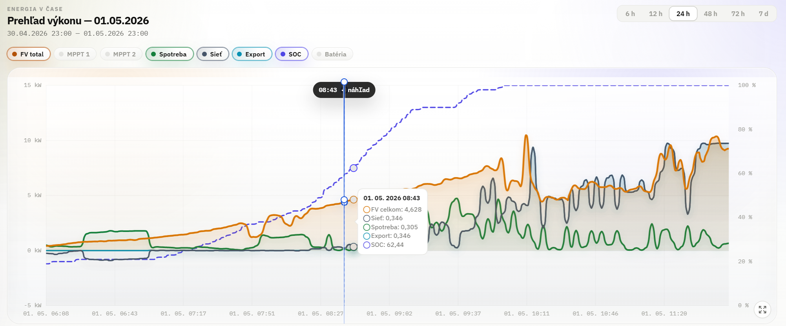
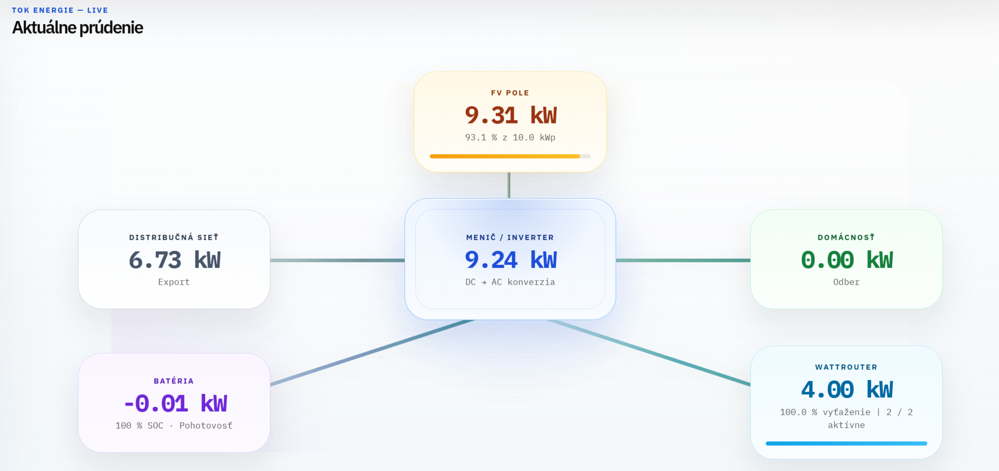
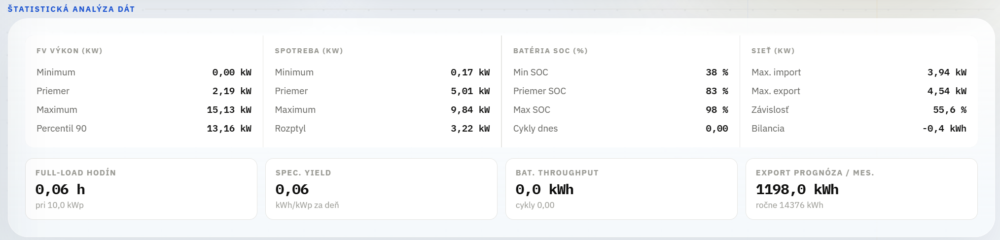
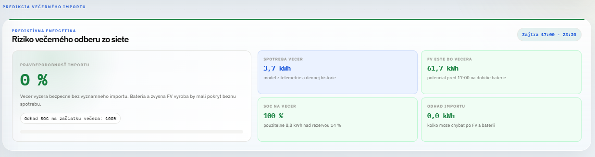
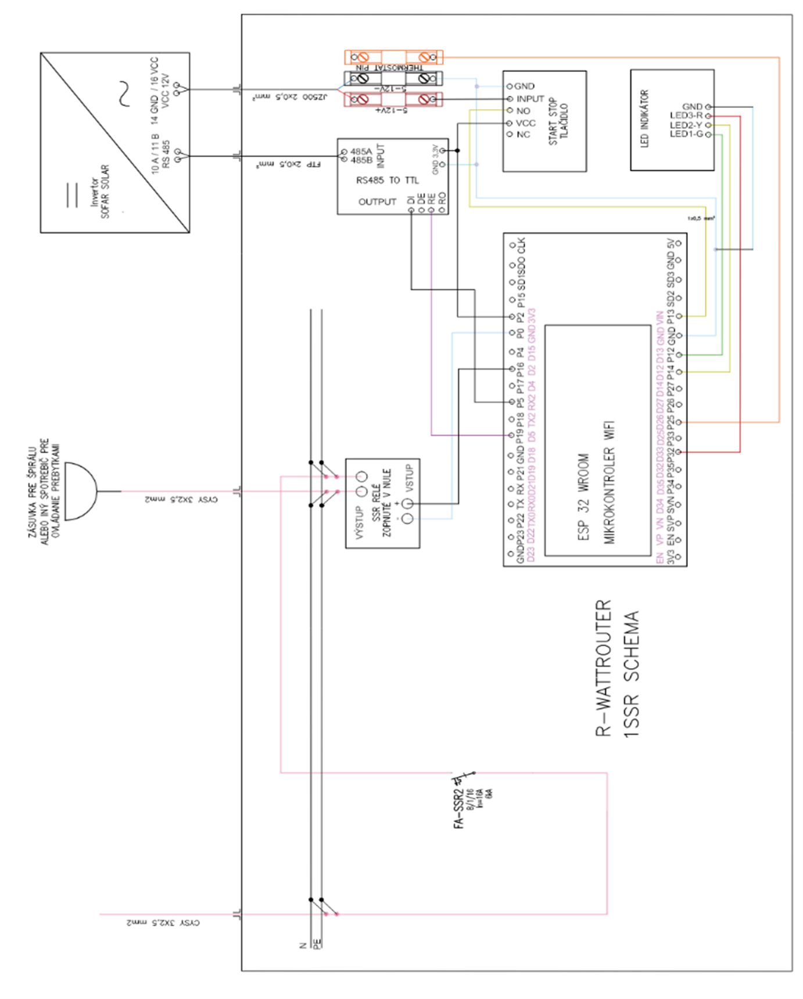
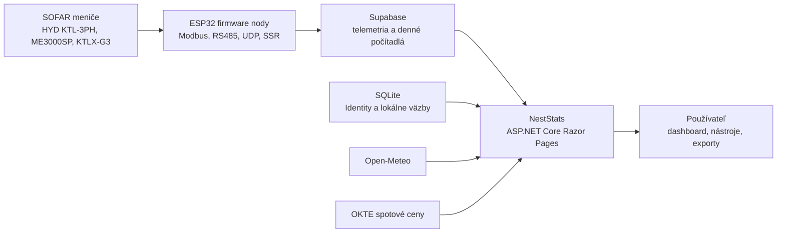
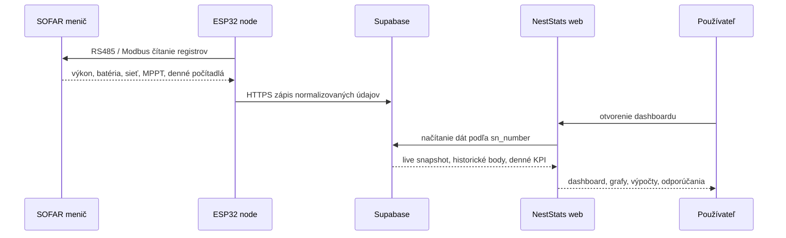

# NestStats

> Energetický workspace pre fotovoltiku, batérie, WattRouter, domácu spotrebu a reálne dáta z meniča.


[Prehľad](#čo-je-neststats) · [Dashboard](#dashboard) · [Architektúra](#architektúra-v-skratke) · [Firmware](#firmware-ekosystém) · [Spustenie](#lokálne-spustenie) · [Dokumentácia](#technická-dokumentácia)

NestStats je webová aplikácia a energetický ekosystém pre ľudí, ktorí nechcú vidieť iba čísla zo striedača, ale chcú pochopiť, čo sa v ich dome deje. Koľko práve vyrába fotovoltika. Koľko berie domácnosť. Či energia ide do batérie, do siete alebo do bojlera cez WattRouter. Kedy vzniká prebytok. Kedy sa systém opiera o distribučnú sieť. A či sa reálne oplatí ďalšia technológia, nie iba podľa odhadu na papieri.

Projekt bol vyvinutý mnou, **Pavol Lukačka**, ako druhá generácia systému NestStats. Jadrom je ASP.NET Core Razor Pages aplikácia, ktorá spája používateľský dashboard, Supabase telemetriu, ESP32 firmware nody, návrhové nástroje a technickú dokumentáciu do jedného pracovného prostredia.

---

## Rýchly pohľad

<p align="center">
  
</p>

<table>
  <tr>
    <td width="50%">
      
      <br>
      <strong>Live tok energie</strong><br>
      Jedna obrazovka pre FV, domácnosť, batériu, sieť a WattRouter.
    </td>
    <td width="50%">
      
      <br>
      <strong>Štatistická analýza</strong><br>
      Denné KPI, historické výsledky a kontrola dátovej kvality.
    </td>
  </tr>
  <tr>
    <td width="50%">
      
      <br>
      <strong>Predikcia a plánovanie</strong><br>
      Odhad výroby podľa počasia a správania systému.
    </td>
    <td width="50%">
      
      <br>
      <strong>Edge vrstva</strong><br>
      ESP32 nody, RS485/Modbus, Supabase a riadené výstupy.
    </td>
  </tr>
</table>

---

## Čo je NestStats

NestStats nie je len dashboard s grafmi. Je to nadstavba nad reálnou fotovoltickou inštaláciou.

Systém je postavený na jednoduchej myšlienke:

1. **Edge nody** pri meničoch a regulátoroch zbierajú dáta alebo vykonávajú riadenie.
2. **Supabase** drží časové rady, denné štatistiky a identifikáciu systémov.
3. **NestStats webová aplikácia** dáta interpretuje, počíta KPI, zobrazuje live stav a pripravuje používateľovi zrozumiteľný energetický príbeh.
4. **Návrhové nástroje** pomáhajú rozhodnúť, či má zmysel fotovoltika, batéria, tepelné čerpadlo alebo úprava spotreby.

Výsledkom je aplikácia, ktorá je použiteľná pre majiteľa domu, energetického konzultanta, inštalačnú firmu aj technického správcu systému.

---

## Prečo vznikol

Bežné aplikácie od meničov často ukazujú výrobu, spotrebu a batériu oddelene. Používateľ potom musí sám skladať odpoveď:

- vyrábam teraz dosť?
- prečo stále importujem zo siete?
- koľko energie reálne ostalo doma?
- pracuje WattRouter správne?
- je nízka vlastná spotreba problém dát alebo správania domu?
- sedí denná štatistika s tým, čo ukazuje menič?
- oplatí sa väčšia batéria alebo tepelné čerpadlo?

NestStats sa snaží tieto otázky zobraziť priamo v jednej vrstve. Nie ako čistú telemetriu, ale ako rozhodovací nástroj.

---

## Hlavné možnosti

| Oblasť | Čo aplikácia rieši |
|---|---|
| Live dashboard | aktuálny stav FV, domu, siete, batérie, meniča a WattRoutera |
| Energetický tok | vizuálna mapa, kadiaľ ide energia práve teraz |
| Denné KPI | výroba, spotreba, import, export, bilancia, sebestačnosť, vlastná spotreba |
| Historická analytika | denné výsledky, agregáty, trendy, batéria v čase, využitie FV |
| Telemetria | MPPT výkon, napätie, prúd, AC fázy, SOC, SOH, teploty, frekvencia |
| WattRouter | výkon, SSR relé, vyťaženie a zachytávanie prebytkov |
| Počasie | aktuálne podmienky podľa adresy systému a kontext pre predikciu |
| Spotové ceny | slovenský OKTE trh dnes a zajtra |
| Návrh FV | výpočet úspory, výroby, návratnosti a PDF report |
| Návrh TČ | orientačný návrh tepelného čerpadla a prevádzkových nákladov |
| 15-minútová analýza | import odberových dát, simulácia FV/batérie, vyhodnotenie vlastnej spotreby |
| Používatelia | registrácia, onboarding, priradenie systému, roly Admin a Client |
| Firmware | ESP32 nody pre zber dát, WattRouter, batériovú reguláciu a displeje |

---

## Architektúra v skratke



Webová aplikácia nečíta menič priamo. Číta databázové tabuľky, ktoré napĺňajú firmware nody alebo existujúca dátová vrstva. Toto oddelenie je dôležité, pretože dashboard môže bežať v cloude, zatiaľ čo meranie a regulácia ostávajú lokálne pri inštalácii.

---

## Dátový tok



Kľúčovým identifikátorom je `sn_number`. Rovnaké sériové číslo musí byť v tabuľke `SYSTEM`, vo firmware a v telemetrických tabuľkách. Práve tým aplikácia vie, ktoré dáta patria ku konkrétnemu používateľovi.

---

## Dashboard

Dashboard je hlavná chránená časť aplikácie. Po prihlásení používateľ vidí iba systémy, ku ktorým má prístup.

Najdôležitejšie časti dashboardu:

- **Live prehľad** - rýchla kontrola, či dáta prichádzajú a či systém pracuje normálne.
- **Tok energie** - FV pole, menič, domácnosť, sieť, batéria a WattRouter v jednej vizuálnej vrstve.
- **Denné KPI** - denné súčty zo striedača a odvodené ukazovatele.
- **Energetický rozpočet** - alokácia kWh medzi spotrebu, export, import a batériu.
- **Historické výsledky** - tabuľka posledných dní s prepínaním 7, 14, 30 dní a všetko.
- **Batéria v čase** - nabíjanie, vybíjanie, SOC a správanie batérie po dňoch.
- **Využitie FV** - ako bola vyrobená energia rozdelená medzi domácnosť, batériu a sieť.
- **Autonómia** - vývoj sebestačnosti a vlastnej spotreby.
- **Telemetria** - MPPT, AC fázy, sieťová kvalita, batéria, WattRouter a hardvérové metriky.
- **Externý kontext** - počasie, predikcia a slovenský spotový trh.

Dashboard používa automatickú obnovu dát, ale s ohľadom na používateľa aj databázu. Používateľ si môže nastaviť interval refreshu od 1 do 10 minút alebo ho vypnúť. Nastavenie sa ukladá do cookie.

---

## Denné KPI a interpretácia

Energetické dáta sú citlivé na dátum, časové pásmo a rozdiel medzi výkonom a energiou. NestStats preto oddeľuje:

- okamžitý výkon v `kW`,
- energiu za deň v `kWh`,
- denné počítadlá zo striedača,
- historické časové rady,
- odvodené ukazovatele.

Základné ukazovatele:

```text
vlastná spotreba kWh = max(0, FV výroba - export)
vlastná spotreba %   = vlastná spotreba kWh / FV výroba * 100

sebestačnosť kWh     = max(0, spotreba - import)
sebestačnosť %       = sebestačnosť kWh / spotreba * 100

bilancia siete       = export - import
závislosť od siete % = import / spotreba * 100
```

Denné súčty majú byť zosúladené s dennými štatistikami meniča. Ak sa líši prvý alebo posledný deň, väčšinou nejde o graf, ale o zlé dátumové okno alebo nesprávne zdrojové počítadlo.

---

## Verejné stránky

Nie všetko v projekte je za loginom. Verejná časť slúži na vysvetlenie platformy, prvé spustenie a návrhové nástroje.

| Stránka | Route |
|---|---|
| O nás | `/spoznaj-nas`, `/about-us` |
| Ako začať | `/ako-zacat`, `/getting-started` |
| Nástroje | `/nastroje`, `/tools` |
| Návrh fotovoltiky | `/navrh-fotovoltaiky`, `/pv-design` |
| Návrh tepelného čerpadla | `/navrh-tc`, `/heat-pump-design` |
| Analýza 15-minútových intervalov | `/analyza-15-minutovych-intervalov`, `/15-minute-interval-analysis` |
| Ochrana údajov | `/Privacy` |

Nástrojové stránky sú zatiaľ vedené primárne v slovenčine, aby výpočty, formuláre a PDF výstupy ostali konzistentné.

---

## Návrhové nástroje

### Návrh fotovoltiky

Nástroj pre orientačný návrh FV systému. Pracuje s výkonom panelov, orientáciou, sklonom, stratami, cenou elektriny, investíciou, infláciou ceny energie a vlastnou spotrebou. Výstupom je odhad výroby, úspory, návratnosti a PDF report s NestStats brandingom.

### Návrh tepelného čerpadla

Nástroj pre porovnanie pôvodného zdroja vykurovania s tepelným čerpadlom. Zohľadňuje budovu, vykurovaciu sústavu, potrebu TUV, SCOP, ceny energií, investíciu, dotáciu a voliteľnú podporu fotovoltiky.

### Analýza 15-minútových intervalov

Najpraktickejší nástroj pre rozhodovanie pred investíciou. Používateľ nahrá reálny 15-minútový profil odberu a aplikácia vyhodnotí spotrebu, chýbajúce intervaly, syntetickú FV výrobu, batériu, import, export, autarkiu, NPV a najlepšie konfigurácie.

Podporované vstupy:

- `.csv`
- `.txt`
- `.xls`
- `.xlsx`

---

## Firmware ekosystém

Priečinok `Firmwares/` obsahuje Arduino/ESP32 firmware nody. Niektoré iba zbierajú dáta, iné vedia riadiť výkonové výstupy.

| Firmware | Úloha |
|---|---|
| `Inverter_fetch_node.ino` | bezpečný zber dát zo striedača bez výkonových výstupov |
| `wattrouter_2SSR_UDP_node.ino` | WattRouter s dvoma SSR, termistorom a UDP správou pre batériový node |
| `wattrouter_3SSR_node.ino` | trojstupňová SSR regulácia pre vyšší alebo delený odporový výkon |
| `wattrouter_3SSR_7segmentdisp_node.ino` | WattRouter s lokálnym 7-segmentovým displejom |
| `wattrouter_3SSR_local_no_wifi_node.ino` | lokálna verzia bez Wi-Fi |
| `Battery_regulator_UDP_node.ino` | batériová regulácia pre ME3000SP na základe potvrdeného prebytku |
| `cheapyellowdispV1_node.ino` | jednoduché lokálne zobrazovanie dát |

Aplikácia poskytuje aj endpointy na stiahnutie firmvérov:

```text
GET /firmwares/download
GET /firmwares/download/{fileName}
```

Pri sťahovaní sa zdrojové súbory sanitizujú, aby sa do exportu nedostali citlivé hodnoty ako Wi-Fi heslá alebo databázové kľúče.

---

## Podporovaný hardvér a dátové zdroje

Aktuálny ekosystém je navrhnutý hlavne okolo meničov SOFAR Solar:

- SOFAR HYD KTL-3PH,
- SOFAR ME3000SP,
- SOFAR KTLX-G3.

Zber dát prebieha cez RS485/Modbus a firmware nody normalizujú hodnoty do databázovej vrstvy. Webová aplikácia potom pracuje už s uloženými časovými radmi a dennými počítadlami.

---

## Databázová vrstva

Projekt používa dve dátové vrstvy:

### 1. Lokálna aplikačná databáza

SQLite cez Entity Framework Core. Slúži najmä pre:

- ASP.NET Core Identity,
- používateľov,
- roly,
- onboarding stav,
- lokálne priradenia systémov,
- bezpečné uloženie aplikačných väzieb.

Predvolená cesta:

```text
App_Data/neststats-auth.db
```

### 2. Supabase telemetrická databáza

Supabase drží energetické dáta a tabuľky zo systému:

| Tabuľka | Význam |
|---|---|
| `SYSTEM` | zoznam energetických systémov, SN, názov, adresa, výkon, batéria, SSR |
| `USERS` | používateľský profil v externej schéme |
| `PV_INFORMATION` | MPPT výkon, napätie, prúd |
| `GRID_INFORMATION` | AC fázy, sieť, PCC, výstupný výkon |
| `BATTERY_INFORMATION` | SOC, SOH, výkon, teplota, cykly |
| `STATISTICAL_INFORMATION` | denné a celkové počítadlá výroby, spotreby, importu, exportu a batérie |
| `WATTROUTER_INFO` | výkon, SSR relé a stav regulácie |

Webová aplikácia pristupuje k týmto dátam cez `SupabaseEnergyDashboardService`.

---

## Použité technológie

| Vrstva | Technológie |
|---|---|
| Backend | ASP.NET Core Razor Pages, .NET 10 |
| UI | Razor, HTML, CSS, vanilla JavaScript |
| Grafy | Chart.js |
| Identity | ASP.NET Core Identity, roly Admin a Client |
| Lokálna DB | SQLite, Entity Framework Core |
| Telemetria | Supabase REST API |
| Počasie | Open-Meteo |
| Spotový trh | OKTE |
| PDF export | iText 7 |
| CSV import | CsvHelper |
| Excel import | ExcelDataReader |
| Firmware | Arduino/ESP32, RS485, Modbus, UDP |
| Hosting | lokálne, Azure App Service alebo iný ASP.NET Core hosting |

---

## Štruktúra projektu

```text
NestStats2/
├── Areas/Identity/                 # ASP.NET Core Identity UI
├── App_Data/                       # lokálna SQLite databáza a runtime súbory, ignorované v Gite
├── Data/                           # DbContext, seeding, identity schema updater
├── Firmwares/                      # ESP32 / Arduino firmware nody s CHANGE_ME placeholdermi
├── Models/                         # doménové modely, DTO, konfiguračné triedy
├── Pages/                          # Razor Pages
│   ├── Admin/                      # admin prehľad a priradenia
│   ├── GettingStarted/             # stránka Ako začať
│   ├── IntervalovaAnalyza/         # 15-minútová analýza odberu
│   ├── Nastroje/                   # rozcestník nástrojov
│   ├── NavrhFotovoltaiky/          # návrh FV
│   ├── NavrhTC/                    # návrh tepelného čerpadla
│   ├── Onboarding/                 # prvé nastavenie používateľa
│   ├── Playbooks/                  # odporúčania a prevádzkové postupy
│   ├── Settings/                   # používateľské nastavenia
│   ├── Shared/                     # layout a zdieľané partials
│   ├── Systems/                    # pripojenie systému
│   ├── Index.cshtml                # hlavný dashboard
│   └── SpoznajNas.cshtml           # about stránka
├── Services/                       # integrácie, dashboard, PDF, email, security
├── wwwroot/                        # statické súbory, obrázky, JS, CSS
├── .gitignore                      # pravidlá pre build výstupy, secrets a lokálne dáta
├── appsettings.Local.example.json  # šablóna lokálnej privátnej konfigurácie
├── NESTSTATS_TECHNICAL_DOCUMENTATION.md
├── Program.cs                      # startup, DI, middleware, routing
├── NestStats2.csproj               # projekt a NuGet balíky
└── global.json                     # .NET SDK verzia
```

Poznámka: pracovné alebo akademické priečinky, lokálne databázy, build výstupy a exporty sú v `.gitignore`, aby verejný repozitár ostal čistý a neobsahoval osobné dáta.

---

## Lokálne spustenie

### Požiadavky

- .NET SDK podľa `global.json`
- prístup k súborovému systému pre SQLite
- voliteľne Supabase projekt pre reálne energetické dáta
- voliteľne SMTP pre e-maily
- voliteľne Google/Facebook OAuth credentials

### 1. Klonovanie repozitára

```powershell
git clone https://github.com/PavolLukacka/NestStats.git
cd NestStats
```

### 2. Obnova balíkov

```powershell
dotnet restore
```

### 3. Nastavenie tajomstiev

Repozitár je pripravený tak, aby mohol ísť na verejný GitHub bez reálnych kľúčov. Súbory `appsettings.json` a `appsettings.Development.json` obsahujú iba bezpečné prázdne hodnoty. Lokálne tajomstvá patria do jedného z týchto miest:

- `.NET user-secrets` pre vývoj na jednom počítači,
- premenné prostredia alebo Azure App Settings pre hosting,
- `appsettings.Local.json` pre lokálny súbor, ktorý je v `.gitignore`.

Najčistejšie lokálne riešenie sú user-secrets:

```powershell
dotnet user-secrets init
dotnet user-secrets set "Supabase:Url" "https://YOUR_PROJECT.supabase.co"
dotnet user-secrets set "Supabase:AnonKey" "YOUR_SUPABASE_ANON_KEY"
dotnet user-secrets set "Email:SmtpPassword" "YOUR_SMTP_PASSWORD"
```

Ak používaš externé prihlasovanie:

```powershell
dotnet user-secrets set "Authentication:Google:ClientId" "YOUR_GOOGLE_CLIENT_ID"
dotnet user-secrets set "Authentication:Google:ClientSecret" "YOUR_GOOGLE_CLIENT_SECRET"
dotnet user-secrets set "Authentication:Facebook:ClientId" "YOUR_FACEBOOK_CLIENT_ID"
dotnet user-secrets set "Authentication:Facebook:ClientSecret" "YOUR_FACEBOOK_CLIENT_SECRET"
```

Alternatíva je lokálny konfiguračný súbor. Skopíruj šablónu a doplň vlastné hodnoty:

```powershell
Copy-Item appsettings.Local.example.json appsettings.Local.json
```

`appsettings.Local.json` sa načíta automaticky po štarte aplikácie, ale neposiela sa do GitHubu.

### 4. Spustenie

```powershell
dotnet run
```

Alebo cez pomocný skript:

```powershell
powershell -ExecutionPolicy Bypass -File .\run-net10.ps1
```

---

## Konfigurácia

Hlavné konfiguračné sekcie:

| Sekcia | Úloha |
|---|---|
| `ConnectionStrings` | SQLite connection string |
| `Supabase` | URL a anon key pre Supabase REST API |
| `Authentication` | potvrdenie účtu, Google a Facebook login |
| `Email` | SMTP alebo lokálny email preview režim |
| `AdminBootstrap` | prvotné vytvorenie admin účtu |
| `DashboardCatalog` | profily systémov, benchmarky taríf, environmentálne faktory |
| `Logging` | aplikačné logovanie |

Do GitHubu nepatria reálne tajomstvá. Tento repozitár preto používa nasledujúce pravidlá:

- `appsettings.json` a `appsettings.Development.json` ostávajú commitnuté, ale bez kľúčov,
- `appsettings.Local.json`, `.env`, databázy, logy, build výstupy a ZIP exporty sú ignorované,
- firmware súbory obsahujú `CHANGE_ME_*` placeholdery namiesto Wi-Fi, Supabase a SN údajov,
- stiahnutie firmvérov cez web endpoint pre istotu ešte raz sanitizuje citlivé konfiguračné riadky.

Po klone teda projekt ostáva kompilovateľný, ale reálne dáta sa zobrazia až po doplnení Supabase konfigurácie.

---

## Bezpečnosť pred publikovaním

Toto je dôležité. Ak ide celý projekt na verejný GitHub, pred pushom sprav aspoň tieto kroky:

```powershell
git status
git diff
```

Skontroluj, že v repozitári nie sú:

- Supabase anon/service kľúče, ktoré nechceš zverejniť,
- Google alebo Facebook client secrets,
- SMTP heslá,
- reálne admin heslá,
- produkčná SQLite databáza,
- súkromné logy,
- exportované ZIP balíky,
- osobné alebo zákaznícke dáta,
- reálne Wi-Fi heslá a sériové čísla vo firmware.

Ak sa tajomstvo už niekedy dostalo do commitu, nestačí ho len vymazať zo súboru. Treba ho považovať za kompromitované a vygenerovať nové.

---

## Autentifikácia a prístupy

Aplikácia používa ASP.NET Core Identity.

Podporované sú:

- lokálna registrácia a prihlásenie,
- reset hesla,
- voliteľné potvrdenie e-mailu,
- Google login,
- Facebook login,
- role `Admin` a `Client`,
- onboarding používateľa,
- priradenie energetického systému ku klientovi.

Klient po registrácii prejde onboardingom a potom si pripojí systém cez sériové číslo a systémové heslo. Admin má prístup k správe používateľov, systémov a priradení.

---

## Exporty

NestStats obsahuje viac výstupov použiteľných pri konzultácii alebo technickej kontrole:

- CSV export dashboardových dát,
- PDF report návrhu fotovoltiky,
- PDF report 15-minútovej intervalovej analýzy,
- výstupy návrhu tepelného čerpadla,
- ZIP export sanitizovaných firmvérov.

Relevantné služby:

```text
Services/NestStatsPvPdfExportService.cs
Services/AnalysisPdfExportService2.cs
```

---

## Technická dokumentácia

Hlavný technický dokument:

```text
NESTSTATS_TECHNICAL_DOCUMENTATION.md
```

Obsahuje detailný popis:

- architektúry,
- middleware pipeline,
- dashboard bootstrap kontraktu,
- dátových tokov,
- Supabase integrácie,
- Open-Meteo a OKTE služieb,
- doménových modelov,
- autorizácie,
- výkonových úvah,
- firmware nodov,
- dashboard grafov,
- dátovej kvality,
- validačného a testovacieho plánu.

Ak chceš pochopiť aplikáciu technicky, začni týmto dokumentom.

---

## Stav projektu

NestStats je aktívne vyvíjaný projekt. Stabilné jadro dnes tvorí:

- dashboard,
- Supabase dátová vrstva,
- používateľské priradenie systémov,
- verejné stránky,
- návrhové nástroje,
- PDF exporty,
- firmware priečinok,
- technická dokumentácia.

Plánované alebo rozpracované smery:

- lepší onboarding pre nové inštalácie,
- čistejšie admin workflow pre priraďovanie systémov,
- detailnejší ekosystémový popis hardvéru,
- viac automatických validačných kontrol dát,
- rozšírenie podporovaných meničov,
- lepšie testovanie edge prípadov pri historických dátach,
- postupné čistenie a modularizácia veľkých dashboardových častí.

---

## Vývojár

Vyvinul:

**Pavol Lukačka**

GitHub: [github.com/PavolLukacka](https://github.com/PavolLukacka)

Projekt vznikol ako praktický energetický systém a zároveň ako technický základ pre akademickú prácu o monitoringu, interpretácii a riadení dát z fotovoltickej domácnosti.

---

## Licencia

Licencia zatiaľ nie je pevne definovaná. Pred širším používaním alebo prijímaním externých príspevkov odporúčam doplniť samostatný `LICENSE` súbor.

---

## Krátka pointa

NestStats je pokus spraviť z domácej energetiky niečo čitateľné. Nie iba tabuľku výkonov, ale systém, ktorý ukáže, čo sa deje, prečo sa to deje a čo s tým môže používateľ urobiť.
